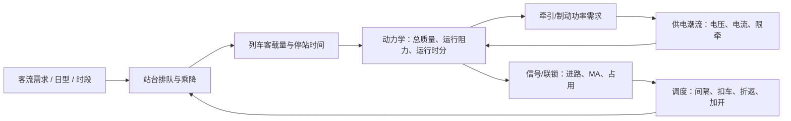

# 独立客流仿真模块与闭环接口说明

## 结论与边界（2026-07-11）

客流模块当前以**独立、可运行的 L2 仿真服务**交付：它拥有自己的时钟、站台排队、双向列车、上下客和停站事件，不读取也不修改 `SimulationEngine` 的状态。这样可以先单独验证客流规律和界面，再以稳定契约接入整体验证，避免两个尚在演进的主循环相互污染。

这不等于“客流已与整套系统闭环”。目前已闭环的是：

```text
时段/日型需求 → 站台到达与排队 → 列车到站 → 下车/容量约束上车
→ 更新站台滞留、列车客载量、停站时间 → 下一列车服务
```

以下整体系反馈尚未接入，属于后续阶段：客载质量到动力学、牵引需求到供电、信号/调度约束到运行时分。

## 当前实现与代码映射

| 职责 | 实现 | 已交付行为 |
|---|---|---|
| 客流生成 | `app/domain/station/services.py` | 分站、分上下行的泊松到达；六时段系数与日型系数 |
| 站台与乘降 | `StationService` | 候车、滞留、下车比例、容量/车门能力约束上车、停站时间 |
| 独立运行时钟 | `app/domain/station/independent_sim.py` | 06:00 起算、双向列车、终点折返、`RUN/DWELL`、事件保留 |
| REST 边界 | `app/api_server.py` | `state/start/pause/resume/step/stop`，不调用主仿真 API |
| 前端展示 | `bj-metro-sim/src/components/StationPassengerView.tsx` | 已有独立客流视图与曲线原型；切换为该 REST 契约驱动仍待单独完成 |

### REST 契约

| API | 含义 |
|---|---|
| `GET /api/passenger-sim/state` | 读取独立客流快照 |
| `POST /api/passenger-sim/start` | 重置后启动，或继续运行 |
| `POST /api/passenger-sim/pause` / `resume` | 暂停或继续独立时钟 |
| `POST /api/passenger-sim/step` | 请求体 `{"seconds": N}`，推进 N 个一秒 tick |
| `POST /api/passenger-sim/stop` | 停止；下一次 start 重建场景 |

快照的权威字段为 `clock`、`stations`、`trains` 和 `events`。其中 `TRAIN_STOP` 事件携带 `boarding`、`alighting`、`onboardPax`、`passengerMassKg`。前端只展示站台信息；列车客载量是为后续适配器保留的输出，并非当前驾驶/动力学已经使用的数据。

## 面向总体仿真的闭环接口



### 接入顺序与单向契约

1. **客流 → 动力学（首要）**：消费 `TRAIN_STOP` 的上下客/`passengerMassKg`，将车辆空载质量与乘客质量合成为每 tick 总质量。动力学按总质量计算基本阻力、坡度阻力、加速度与区间运行时分。
2. **动力学 → 供电**：输出牵引/再生功率需求；供电潮流返回母线电压、可用功率或限牵。动力学据此限幅，不直接由客流修改电压。
3. **信号/联锁 → 调度 → 客流**：联锁给出可建立进路、占用和 MA；调度据此下达发车、扣车、折返或加开决策；客流服务消费的是实际到站/发车时间，从而改变候车积压。
4. **多车调度**：用站台等待人数、滞留人数、密度、预测到达率作为需求侧 KPI；用信号安全间隔、供电限牵和车辆可用性作为约束。不能仅用客流峰值直接“加车”。

适配器应通过事件/命令契约接入主 tick，禁止客流服务直接 import 或写入 `SimulationEngine`、供电、信号或调度对象。这样可避免同一 tick 内循环依赖和双重状态源。

## 阶段验收口径

| 阶段 | 完成判据 | 当前状态 |
|---|---|---|
| 独立客流 L2 | 启停、时钟、双向上下客、站台快照和曲线均来自后端 | 本次实现 |
| 客流—动力学 L3 | 同一列车的上下客改变总质量；质量变化可在阻力/区间时间回归中观察 | 未接入 |
| 动力学—供电 L3 | 牵引/再生功率影响潮流，电压/限牵回写动力学 | 未接入/需复验 |
| 调度—信号—客流 L4 | 多车间隔/扣车/折返经信号约束后改变实际到站与站台积压 | 未接入 |
| 全链路 L5 | 人数、质量、能量守恒与多场景回归报告可复现 | 未接入 |

因此当前对外表述应为：“独立客流仿真闭环已完成，整体系跨模块闭环接口和接入顺序已定义；质量—动力学—供电—信号/调度反馈仍待分阶段实现与验收。”
