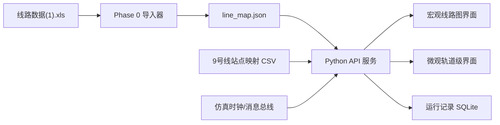

# BJTUMetroSim 前端接入与双层界面设计

## 1. 当前拉取结果

已将 GitHub `frontend` 分支拉取到：

`external/BJTUMetroSim`

其中主要目录如下：

- `bj-metro-sim/`：React + TypeScript + Vite 前端工程，使用 MapLibre 绘制北京地铁线路图。
- `MetroDynamicsJavaDemo/`：9 号线一维车辆动力学 Java demo，含站点里程、坡度、输出仿真 CSV。

前端当前数据结构为：

```ts
interface MetroLineData {
  id: string;
  name: string;
  color: string;
  coordinates: [number, number][][]; // 地理坐标线路
  stations: { name: string; lat: number; lng: number }[];
}
```

前端当前通过高德公交线路 API 拉取北京地铁全网线路，并缓存在浏览器 localStorage。9 号线在前端线路 ID 中对应 `id = "9"`，颜色为 `#8FC31F`。

## 2. 与现有 Phase 0 后端的关系

现有 Phase 0 已从 `docs/线路数据(1).xls` 生成：

- `data/cache/line_map.json`
- `data/cache/import_report.json`

该缓存包含 9 号线轨道级数据：

- Seg：319
- 信号机：157
- 站台：56
- 应答器：374
- 坡度：182
- 静态限速：238
- 进路：249

另一个可用参考是 `MetroDynamicsJavaDemo/data/stations.csv`，其中给出了 9 号线 13 个车站的中文站名、站码与一维里程：

| 序号 | 站码 | 站名 | 里程 m |
|---:|---|---|---:|
| 1 | GGZ | 郭公庄 | 313.000 |
| 2 | FSP | 丰台科技园 | 1660.520 |
| 3 | KYL | 科怡路 | 2448.610 |
| 4 | FTN | 丰台南路 | 3429.320 |
| 5 | FTD | 丰台东大街 | 5014.460 |
| 6 | QLZ | 七里庄 | 6339.900 |
| 7 | LLQ | 六里桥 | 8118.830 |
| 8 | LLE | 六里桥东 | 9429.160 |
| 9 | BWR | 北京西站 | 10598.740 |
| 10 | JBG | 军事博物馆 | 11996.970 |
| 11 | BDZ | 白堆子 | 13906.770 |
| 12 | BQS | 白石桥南 | 14954.010 |
| 13 | GTG | 国家图书馆 | 16048.920 |

这份 CSV 正好可作为“宏观地图站点名称/坐标”与“老师线路表站台里程/Seg”的映射桥。

## 3. 双层界面是否合理

合理，而且建议明确拆成两个主视图：

1. 宏观线路图界面：面向运营调度、列车运行态势、客流/负载、延误传播。
2. 微观轨道级界面：面向列控、联锁、信号机、进路、区段占用、限速/坡度/应答器等设备级仿真。

原因：

- 两个视图的数据粒度不同。宏观图关心“站-区间-列车-客流”，微观图关心“Seg-信号机-道岔-计轴/逻辑区段-进路”。
- 两个视图的坐标体系不同。宏观图使用经纬度或示意线路图；微观图更适合使用一维里程 + 拓扑结构，或局部轨道平面图。
- 两个视图的交互目标不同。宏观图用于看态势与调度结果，微观图用于解释为什么不能发车、为什么停车、哪条进路锁闭、哪段限速生效。

## 4. 推荐总架构



建议新增一个轻量 Python HTTP API 层，先不直接让前端读本地 JSON 文件。原因是后续仿真状态、列车位置、区段占用、进路办理都需要动态推送，HTTP/WebSocket API 更自然。

v0.2 起，前端还应承担“多保真实验可解释展示”的职责：用户必须能看出当前状态来自自研仿真、Mock 接口还是学校平台真实接口。否则宏观图和轨道级图虽然好看，但不能支撑算法实验结论。

建议前端全局增加运行模式标识：

| 模式 | 前端显示 | 含义 |
|---|---|---|
| Pure-Sim | 自研仿真 | 所有业务模块由本系统自研模型产生 |
| Hybrid-Sim | 混合仿真 | 部分模块调用学校平台接口，如车辆/司机台/视景；供电当前仍为自研模型 |
| Platform-in-the-loop | 平台闭环 | 多个学校平台接口参与闭环，用于高保真验证 |
| Degraded | 降级 | 平台接口断开或超时，系统回退到 Mock/自研模型 |

## 5. 宏观线路图界面设计

### 5.1 目标

展示 9 号线整体运行态势，支持从全网地图聚焦到 9 号线，并把列车、站点、区间、负载、晚点等状态叠加在地图上。

### 5.2 数据来源

短期可用三类数据：

- 前端现有高德 API：提供 9 号线经纬度 polyline 和站点经纬度。
- `MetroDynamicsJavaDemo/data/stations.csv`：提供站码、中文站名、一维里程。
- `line_map.json`：提供平台、Seg、信号机、限速、坡度、进路等轨道级数据。

### 5.3 页面元素

- 地图主体：只显示 9 号线，默认隐藏其他线路。
- 站点节点：13 个车站，显示站名、站码、里程。
- 列车图标：按仿真状态沿 9 号线移动。
- 区间状态：正常、拥挤、延误、故障、限速、封锁。
- 右侧运营面板：当前时刻、运行列车数、平均满载率、平均等待时间、准点率。
- 底部时间轴：可播放、暂停、倍速、拖动回放。

### 5.4 主要交互

- 点击车站：显示客流、上下车、候车人数、站台关联 Seg。
- 点击区间：显示运行时间、限速、坡度、当前列车、区间占用状态。
- 点击列车：显示列车位置、速度、目标速度、负载率、下一站、ATO/人工模式。
- 点击“进入轨道级”：跳转到该站或该区间对应的微观轨道视图。

## 6. 微观轨道级界面设计

### 6.1 目标

展示 9 号线局部或全线轨道拓扑，用于解释列控/联锁/信号系统状态，是仿真系统的专业核心界面。

### 6.2 数据来源

直接来自 `line_map.json`：

- `segments`：轨道 Seg 拓扑、长度、相邻关系。
- `signals`：信号机位置、类型、防护方向。
- `platforms`：站台关联 Seg、站台中心公里标。
- `speedRestrictions`：静态限速。
- `gradients`：坡度。
- `axleSections` / `logicalSections`：区段占用与列控逻辑。
- `routes` / `protectionSections`：进路与保护区段。
- `balises`：应答器。

### 6.3 页面元素

- 轨道 Seg 线段：按拓扑连接，显示 Seg ID、长度、方向。
- 站台：贴在对应 Seg 上，显示站台 ID、站名、方向。
- 信号机：按 Seg 偏移量放置，显示红/黄/绿/灭灯等仿真状态。
- 道岔：显示定位/反位、锁闭、故障。
- 区段占用：计轴区段/逻辑区段用色块或底纹表示。
- 限速/坡度：可作为图层开关叠加。
- 进路：选中进路后高亮始端信号、终端信号、计轴区段、保护区段、接近/触发区段。

### 6.4 主要交互

- 选择车站/区间：只显示附近若干 Seg，避免全线 319 个 Seg 一次性拥挤展示。
- 点击信号机：查看允许/禁止状态、关联进路、前方区段占用。
- 点击道岔：查看定位/反位、是否锁闭、被哪条进路占用。
- 点击列车：查看所在 Seg、偏移量、前方信号、前方限速、目标速度。
- 点击进路：尝试办理/取消进路，显示失败原因。

## 7. 宏观与微观的映射关系

关键是建立一张 `station_mapping`：

```json
{
  "lineId": "9",
  "stationCode": "GGZ",
  "stationName": "郭公庄",
  "mileageM": 313.0,
  "stationId": 1,
  "platformIds": [1, 2],
  "platformSegmentIds": [13, 39],
  "lat": 39.814,
  "lng": 116.303
}
```

映射规则：

- 用 `stations.csv` 的 `code/name/mileage_m` 作为中文站名来源。
- 用 `line_map.json` 的 `stations` 表获得站码与站台 ID。
- 用 `line_map.json` 的 `platforms` 表获得平台中心里程与关联 Seg。
- 用前端高德 9 号线站点获得经纬度。
- 通过站码、站点顺序、平台里程三者交叉校验。

## 8. API 设计建议

正式 API 契约见 `docs/设计文档/API设计文档.md`。本节保留前端接入所需的核心接口清单，作为页面改造索引。

Phase 0/1 可先提供 HTTP API：

| API | 用途 |
|---|---|
| `GET /api/health` | 服务状态 |
| `GET /api/lines/9/macro` | 9 号线宏观地图数据，兼容前端 `MetroLineData` |
| `GET /api/lines/9/stations` | 站点映射表 |
| `GET /api/lines/9/track-map` | 轨道级拓扑数据 |
| `GET /api/track/segments/{segId}` | 查询单个 Seg |
| `GET /api/track/segments/{segId}/context` | 查询 Seg 周边信号、站台、限速、坡度 |
| `GET /api/sim/state` | 当前仿真状态快照 |
| `GET /api/adapters/health` | 平台接口健康状态 |
| `GET /api/experiments/{runId}/summary` | 优化实验结果摘要 |
| `POST /api/sim/start` | 启动仿真 |
| `POST /api/sim/pause` | 暂停仿真 |
| `POST /api/sim/resume` | 恢复仿真 |
| `POST /api/sim/stop` | 停止仿真 |
| `WS /api/sim/stream` | 推送列车位置、信号、区段占用、KPI |
| `WS /api/adapters/stream` | 推送接口连接、丢包、CRC、解析错误 |

Phase 2 前端还需要使用：

| API | 用途 |
|---|---|
| `GET /api/interlocking/routes` | 进路表和进路状态 |
| `POST /api/interlocking/routes/{routeId}/request` | 办理进路 |
| `POST /api/interlocking/routes/{routeId}/release` | 释放进路 |
| `GET /api/sections/occupation` | 区段占用和追踪间隔 |
| `GET /api/stations/crowd` | 站台候车和拥挤度 |
| `GET /api/trains/load` | 列车负载 |
| `GET /api/dispatch/state` | 调度决策 |
| `GET /api/power/state` | 自研供电分区、牵引限额、能耗和再生吸收 |
| `GET /api/disturbances` | 扰动事件 |
| `POST /api/disturbances` | 注入扰动 |

## 9. 前端改造建议

当前前端可以保留 MapLibre 地图能力，但建议做以下调整：

1. 新增 `src/data/backendApi.ts`，封装访问 Python API。
2. 新增 `src/types/sim.ts`，统一宏观/微观数据类型。
3. `App.tsx` 从“直接调用高德 API”改为“优先调用后端 `/api/lines/9/macro`”。
4. `useSimStore.ts` 增加：
   - `selectedLineId`
   - `selectedStationCode`
   - `selectedSegmentId`
   - `trackMap`
   - `simSnapshot`
5. 新增页面/组件：
   - `MacroLineView`
   - `MicroTrackView`
   - `StationDetailPanel`
   - `SegmentInspector`
   - `SignalInspector`
   - `RouteInspector`
6. 左侧或顶部加视图切换：
   - `宏观线路`
   - `轨道级`
   - `接口状态`
   - `运行记录`

接口状态视图建议显示：

- SignalUdpAdapter：周期、最后接收时间、丢包、解析错误。
- CabTcpAdapter：PLC/网络屏/信号屏连接状态。
- VehicleUdpAdapter：20ms 数据接收状态、车辆输出延迟。
- RtLabApiAdapter：项目加载、执行状态、变量读写错误；仅标识车辆/RT-LAB 接口状态，不显示为供电接口。
- ViewUdpAdapter：100ms 视景同步状态。
- PowerService：供电分区、牵引限额、能耗和再生吸收均来自自研模型；若未来获得明确供电协议，再新增 PowerAdapter 状态。

这些不是装饰性状态灯，而是算法实验可信度的一部分。

## 10. 分阶段实现

### 阶段 A：接上前端，只显示 9 号线

- 拉取前端工程。
- 后端新增 `/api/lines/9/macro`，返回 9 号线数据。
- 前端屏蔽全网线路，只显示 9 号线。
- 点击站点显示站名、站码、里程、平台 ID、关联 Seg。

### 阶段 B：轨道级静态视图

- 后端新增 `/api/lines/9/track-map`。
- 前端新增微观轨道视图。
- 先画 Seg、站台、信号机、限速、坡度。
- 支持从宏观站点跳转到对应平台 Seg。

### 阶段 C：接入仿真状态

- 后端暴露仿真时钟和消息总线状态。
- 前端订阅 `WS /api/sim/stream`。
- 宏观图显示列车移动、站间运行、KPI。
- 微观图显示区段占用、信号状态、进路状态。
- 接口状态面板显示 Mock/自研/平台来源与接口健康。

### 阶段 D：联锁/列控交互

- 支持办理进路、取消进路、道岔锁闭、信号开放。
- 微观界面展示联锁检查失败原因。
- 宏观界面展示由设备状态引起的晚点传播。

### 阶段 E：多保真优化实验展示

- 显示基线策略、优化策略和消融策略的运行结果。
- 在宏观图显示延误传播、客流积压、列车负载。
- 在微观图解释信号/进路/限速/自研供电约束如何限制优化策略。
- 展示自研模型结果与平台接口复核结果之间的偏差，并明确供电指标不是平台直接输出。

## 11. 关键风险

- 经纬度线路图与老师 Excel 的里程/Seg 不是同一坐标体系，需要映射层，不能直接混用。
- 老师表里的站名是站码，如 `GGZ/FSP/KYL`，中文站名需要从 CSV 或外部字典补充。
- `platforms` 有 56 条，明显多于 13 个车站，表示不同方向/站台/停车区域，需要合并成车站级节点。
- 微观轨道拓扑不能直接按经纬度画，需要根据 Seg 长度和相邻关系生成局部布局。
- 前端当前依赖高德 API key，若要课堂演示稳定，建议后端提供静态 9 号线宏观数据，前端不依赖实时外部 API。
- 平台接口状态必须可见，否则无法证明优化实验是在真实接口闭环、Mock 闭环还是降级模式下完成。

## 12. 结论

可以接上，而且建议按“后端统一提供 9 号线宏观数据 + 轨道级数据”的方式接。

宏观线路图负责回答：

- 车在哪里？
- 哪个站拥挤？
- 哪个区间延误？
- 调度策略效果如何？

微观轨道级界面负责回答：

- 为什么不能发车？
- 前方信号/限速/坡度是什么？
- 哪个区段被占用？
- 哪条进路被锁闭？
- 列控和联锁逻辑如何影响运行？

这两个界面应该联动，而不是互相替代。
