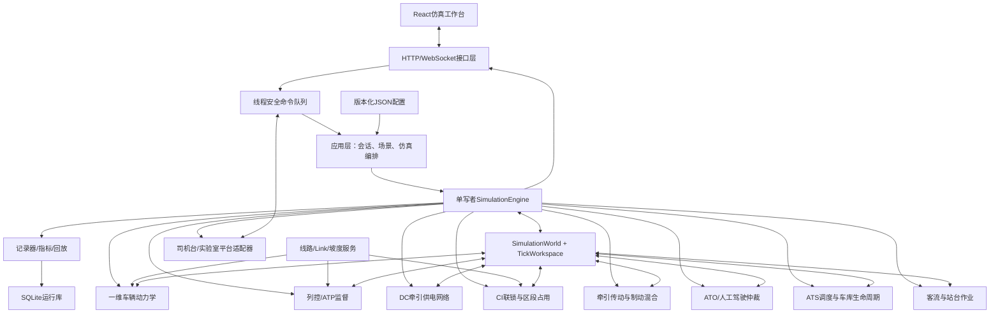
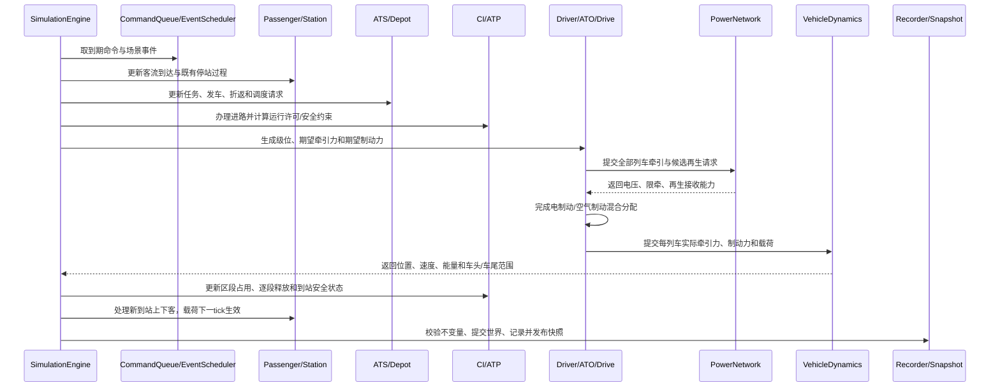
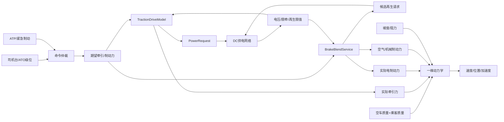
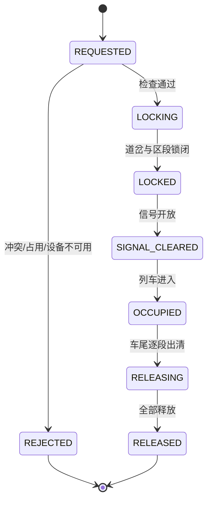
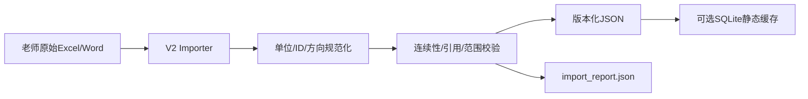

# 轨道交通综合仿真系统概要设计说明书 2.0

文档状态：概要设计草案，供项目组审核
版本：2.0
编制日期：2026-07-10
上位文档：`docs/需求与调研文档/轨道交通综合仿真系统需求说明书2.0.md`
设计范围：Stage 0至Stage 4总体架构；不替代各模块详细设计

## 1. 文档目的

本文档给出轨道交通综合仿真系统2.0的总体软件结构和关键设计决策，回答以下问题：

1. 四个业务模块如何划分职责，如何避免重复建模和直接修改彼此状态。
2. 多列车如何在同一仿真时钟和同一权威状态中运行。
3. 客流、调度、联锁、驾驶、车辆动力学和供电如何在一个tick内形成闭环。
4. 老师提供的车辆子系统关系图如何映射到本项目，而不混淆车辆牵引传动与牵引供电网络。
5. 场景、命令、API、数据库和前端如何围绕仿真实验组织，而不是退化为监控展示。
6. 如何从当前单车为主的实现增量迁移到2.0，而不进行一次性重写。

本文档通过审核后，应继续编制以下详细设计：

1. 数据导入与统一契约详细设计。
2. 供电仿真详细设计。
3. 驾驶、牵引传动、制动混合和一维动力学详细设计。
4. 联锁、ATS调度与车库生命周期详细设计。
5. 客流、站台作业与热力图详细设计。
6. API、数据库和前端2.0详细设计。

## 2. 设计输入与约束

### 2.1 设计输入

| 输入 | 设计影响 |
|---|---|
| 需求说明书2.0 | 四模块边界、完整闭环、Stage 0至4、验收场景 |
| 老师答辩点评 | 仿真而非监控、多车一致性、误差参照、时延、客流取舍 |
| 老师子系统关系图 | 车辆内部牵引、制动、ATO/ATS、动力学和司机控制台之间的交换量 |
| 线路数据说明与Link表 | 上下行分别建模、Link/Seg映射、厘米单位、主线与车辆段边界 |
| 列车仿真参数表 | 6辆编组、225 t空车质量、118 m车长、52点特性曲线和戴维斯阻力 |
| 现有Python/React实现 | 线路、ATO、车辆、联锁、客流、供电、记录和页面可复用基础 |

### 2.2 核心约束

1. 系统是教学研究仿真，不是实际行车控制或数字孪生。
2. 常规场景只模拟教学线路主线上下行；车辆段采用抽象模型。
3. 首个完整验收规模为3至5列车，架构不应限制后续扩展。
4. 仿真内部统一采用SI单位，原始厘米、转速等值在导入层完成转换。
5. 无可靠数据的参数必须带`ASSUMED`或`CALIBRATED`标记。
6. 本阶段不依赖云数据库；单机运行是首要部署方式。
7. 所有安全判断由后端权威模型完成，前端动画不参与安全逻辑。

## 3. 关键架构决策

| 决策ID | 决策 | 理由 |
|---|---|---|
| AD-001 | 采用模块化单体，不立即拆微服务 | 5人团队、单线小规模仿真更需要低通信成本和统一时钟 |
| AD-002 | 每个交互式会话只有一个仿真线程可以写运行状态 | 保证确定性，避免HTTP线程和求解线程并发修改对象 |
| AD-003 | 外部操作全部进入命令队列，在tick边界执行 | 故障、复位、级位和进路请求可排序、可记录、可回放 |
| AD-004 | 一个tick内使用工作区暂存阶段结果，结束时原子发布快照 | 前端和记录器不会看到半更新状态 |
| AD-005 | 配置对象与运行状态对象分离 | 防止运行时意外修改线路、车辆和供电静态参数 |
| AD-006 | 内部领域模型使用dataclass/枚举，HTTP边界使用显式DTO校验 | 兼顾计算性能、清晰边界和接口校验 |
| AD-007 | 规范化JSON作为教学静态数据权威源，SQLite保存运行记录 | 便于版本控制、审查、迁移和本地实验 |
| AD-008 | ATS、ATO和CI分为不同服务 | ATS管计划，ATO管单车驾驶，CI管进路安全，不能相互越权 |
| AD-009 | 车辆牵引传动与DC牵引供电网络分为不同模型 | 老师关系图中的“牵引系统”主要是车载传动，不能与供电网混为一谈 |
| AD-010 | 制动采用需求、能力和实际分配三阶段模型 | 支持电制动优先、空气/机械制动补足和再生受限 |
| AD-011 | 客流使用站台方向分时段聚合模型 | 不需要OD和乘客个体即可形成载荷、停站、调度闭环 |
| AD-012 | 固定闭塞、简化移动授权和抽象车库作为2.0安全边界 | 达到课程仿真目的，同时避免伪造工程级CBTC和车辆段联锁 |

## 4. 总体架构

### 4.1 逻辑架构



### 4.2 分层职责

| 层 | 职责 | 禁止事项 |
|---|---|---|
| 表现层 | 场景输入、操作、状态观察、回放和对比 | 根据动画反推占用或在浏览器计算安全结果 |
| 接口层 | DTO校验、鉴权预留、命令入队、快照查询、推送 | 直接修改`PowerService`、列车或联锁内部字段 |
| 应用层 | 会话生命周期、场景加载、命令调度、tick编排 | 包含具体动力学或联锁公式 |
| 领域层 | 四业务模块及线路、列控等领域规则 | 依赖HTTP、React、SQLite表结构 |
| 基础设施层 | 文件导入、SQLite、外部协议、日志 | 决定领域安全或调度策略 |

### 4.3 目标目录结构

```text
app/
  application/
    simulation_engine.py
    simulation_session.py
    tick_pipeline.py
    command_service.py
    scenario_service.py
  contracts/
    common.py
    train.py
    control.py
    interlocking.py
    passenger.py
    power.py
    events.py
  core/
    clock.py
    message_bus.py
    ids.py
    units.py
  domain/
    line/
    vehicle/
      config.py
      notch_mapper.py
      traction_drive.py
      brake_blending.py
      dynamics.py
    control/
      ato.py
      atp.py
      command_arbiter.py
      delay_buffer.py
    passenger/
    station/
    interlocking/
    dispatch/
    depot/
    power/
  infrastructure/
    importers/
    persistence/
    adapters/
  interfaces/
    http/
    websocket/
  api_server.py
```

迁移期间保留现有包路径，由兼容门面调用新组件；稳定后再删除重复的Phase/demo实现。

## 5. 仿真内核概要设计

### 5.1 核心对象

| 对象 | 职责 |
|---|---|
| `SimulationSession` | 一次交互或批量仿真会话，持有配置、引擎、命令队列和运行ID |
| `SimulationEngine` | 唯一写者，执行生命周期和tick流水线 |
| `SimulationWorld` | 当前权威运行状态，按实体ID保存列车、站台、进路、供电和事件 |
| `TickContext` | tick、仿真时间、dt、随机源、活动事件和参数版本 |
| `TickWorkspace` | 本tick各阶段中间结果，成功后一次性提交 |
| `WorldSnapshot` | 不可变、可序列化的前端/记录器快照 |
| `SimulationCommand` | 外部操作请求，带命令ID、发出时间和预期执行时间 |
| `DomainEvent` | 已发生且不可变的业务事实，用于记录、指标和回放 |

### 5.2 单写者与原子快照

1. API、WebSocket和外部适配器只能向`CommandQueue`提交命令。
2. 只有`SimulationEngine`的仿真线程可以修改`SimulationWorld`。
3. 每个tick开始时引擎读取当前世界状态和已到期命令。
4. 各领域服务把结果写入`TickWorkspace`，不得直接发布中间快照。
5. 所有阶段成功后，工作区提交为新世界状态并替换原子快照引用。
6. 任一关键安全或求解阶段失败时，本tick不提交，引擎按故障策略暂停或终止。

该设计替代当前HTTP处理函数直接调用供电网络对象的方式。故障注入、开关操作和复位均变为可排序、可回放的仿真命令。

### 5.3 命令生命周期

```text
RECEIVED -> VALIDATED -> QUEUED -> APPLIED
                              -> REJECTED
                              -> EXPIRED
```

HTTP返回`QUEUED`只表示命令已进入队列，不表示领域操作已成功。最终结果通过命令查询、事件流或下一快照返回。

命令排序键为：

```text
(effectiveSimTimeMs, priority, acceptedSequence)
```

安全命令优先级高于普通操作；同优先级按后端接受序号稳定排序，从而保证相同输入可重复。

### 5.4 tick流水线



### 5.5 多速率任务

基础仿真tick默认250 ms。不同任务采用tick倍频或降频，不建立互相独立且无时间戳的计时器。

| 任务 | 推荐周期 | 说明 |
|---|---:|---|
| 命令、控制、动力学、占用 | 250 ms | 安全与运动主链路 |
| 准静态供电潮流 | 250 ms | 与实际列车命令同步 |
| 前端快照 | 250 ms或500 ms | 可配置降采样 |
| 客流参数分桶 | 5 min仿真时间 | 到达人数仍按tick累计 |
| 运行记录状态采样 | 1 s | 关键事件即时记录 |
| 指标汇总 | 1 s或场景结束 | 不影响领域状态 |

### 5.6 确定性设计

1. 所有随机客流使用会话级随机种子和可重复子流。
2. 不在领域算法中读取系统当前时间。
3. 迭代集合按稳定业务ID排序，禁止依赖字典偶然顺序表达优先级。
4. 外部输入在进入命令队列时固定时间戳和顺序。
5. DCDP等速度曲线在场景启动前预计算或按确定性缓存，避免阻塞实时tick。

## 6. 老师子系统关系图的设计映射

### 6.1 参考图的有效信息

老师关系图给出了以下重要交换关系：

1. 多车司机控制台提供牵引、制动、紧急制动、质量、限速和故障输入。
2. ATO/ATS读取速度和列车初始信息，输出牵引或制动指令。
3. 动力学接收实际牵引力、实际制动力和列车载荷，输出速度和积分步长结果。
4. 牵引系统和制动系统之间交换电制动请求、可用状态和实际电制动力。
5. 当电制动不足或不可用时，空气制动承担剩余制动力。

### 6.2 本项目的必要拆分

参考图中的名称在本项目中映射为：

| 参考图对象 | 2.0组件 | 说明 |
|---|---|---|
| 多车司机台 | `CabInputAdapter` + `CommandArbiter` | 输入外设，不拥有列车物理状态 |
| ATO/ATS | `ATOController`与`ATSService` | 必须拆分；ATO控制单车，ATS管理运营计划 |
| 动力学 | `LongitudinalDynamicsModel` | 使用总质量、坡度、阻力和实际合力积分 |
| 牵引系统 | `TractionDriveModel` | 车载电机/逆变器/传动模型，不是牵引供电网络 |
| 制动系统 | `BrakeBlendService` + `PneumaticBrakeModel` | 分配电制动和空气/机械制动 |
| 图外供电网络 | `DCTractionPowerNetwork` | 提供电压、限牵和再生接收能力 |

### 6.3 车辆内部力链路



### 6.4 制动混合策略

常用制动按以下顺序执行：

1. `CommandArbiter`根据B1-B7计算期望总制动力。
2. `BrakeBlendService`根据当前速度和电制动曲线计算候选电制动力。
3. 供电网络根据线路电压、邻车牵引和可逆变电所能力返回再生接收比例。
4. 实际电制动力取候选能力与再生限值的较小值。
5. 空气/机械制动补足期望总制动力与实际电制动力之间的差额。
6. 紧急制动不依赖再生可用性，必须保证配置的紧急制动能力。

该分配策略保证供电故障不会导致安全制动力凭空消失，也使再生能量、机械制动消耗和列车减速度能够相互核对。

## 7. 模块一：供电仿真概要设计

### 7.1 组件

| 组件 | 职责 |
|---|---|
| `PowerTopologyRepository` | 加载牵引所、馈电臂、接触轨、回流轨和开关配置 |
| `TrainLoadAssembler` | 将全部列车牵引、辅助和候选再生请求转换为电气负荷 |
| `DCPowerFlowSolver` | 统一求解多车准静态DC网络 |
| `RegenAllocationService` | 分配邻车吸收、可逆变电所反馈和制动电阻浪费 |
| `PowerProtectionService` | 计算欠压、过流、过载、限牵和告警 |
| `PowerCommandHandler` | 处理N-1、馈电臂和联络开关命令 |
| `PowerMetricService` | 计算损耗、峰值、能量和守恒残差 |

### 7.2 输入与输出

输入：

1. 全部活动列车的受电位置、方向、速度和辅助功率。
2. `TractionDriveModel`产生的牵引功率需求。
3. `BrakeBlendService`产生的候选再生功率。
4. 供电拓扑、设备状态和活动故障。

输出：

1. 每车电压、电流、牵引限值、再生限值和相邻供电设备。
2. 每牵引所、馈电臂和分段的有符号潮流。
3. 牵引、邻车再生吸收、交流侧反馈、浪费和线路损耗。
4. 欠压、过流、过载、孤立区段和求解失败事件。

### 7.3 求解流程

```text
定位全部列车受电分区
  -> 形成正负有功功率请求
  -> 分析当前拓扑连通性与供电路径
  -> 迭代求解列车端电压和网络电流
  -> 计算设备潮流与线路损耗
  -> 分配再生能量去向
  -> 计算牵引/再生限制和保护状态
  -> 检查有符号功率平衡
```

求解器需要设置最大迭代次数、收敛阈值和电压边界。未收敛时不得发布“正常”状态；交互会话默认暂停并保留最后有效快照。

### 7.4 状态与配置分离

静态配置包括设备位置、额定值、电阻、正常开关状态和来源。运行状态包括当前开关、牵引所服务状态、电压、电流、功率、能量和告警。复位命令从静态配置恢复拓扑状态，但不重置仿真时钟、列车状态或历史记录。

## 8. 模块二：驾驶与一维动力学概要设计

### 8.1 组件

| 组件 | 职责 |
|---|---|
| `CabInputAdapter` | 统一虚拟司机台、实体司机台和Replay输入 |
| `CommandArbiter` | 处理模式、ATP覆盖、EB优先级和互斥命令 |
| `NotchMapper` | 将P1-P4、B1-B7映射为能力系数 |
| `ATOController` | 生成目标速度和可解释级位请求 |
| `DelayBuffer` | 模拟信号、状态和执行器时延 |
| `TractionDriveModel` | 根据转速/速度曲线、供电电压和级位计算实际牵引能力 |
| `BrakeBlendService` | 计算电制动与空气/机械制动分配 |
| `PneumaticBrakeModel` | 建立/缓解延迟及实际空气制动力 |
| `LongitudinalDynamicsModel` | 纵向力平衡和数值积分 |
| `TrainGeometryService` | 根据118 m车长计算车头、车尾和跨Link范围 |

### 8.2 参数模型

`VehicleConfig`由以下部分组成：

1. 编组、各车质量、长度、轴数、迎风面积和乘客平均质量。
2. 电机数量、轮径、传动比和效率。
3. 52点牵引/制动特性和转速轴定义。
4. 戴维斯阻力参数。
5. P/B级位能力系数。
6. 空气制动、紧急制动和执行延迟参数。
7. 最大速度、加速度、减速度和加加速度监测阈值。

参数导入后形成不可变配置对象；每列车只保存配置ID和运行状态，不复制或运行中改写曲线。

### 8.3 控制优先级

```text
系统紧急/ATP紧急制动
  > 人工EB
  > ATP常用制动监督
  > 当前模式控制源（MANUAL或ATO）
  > COAST
```

ATS不直接输出牵引/制动级位。ATS只调整任务、目标运行时间、停站或速度等级，由ATO在CI/ATP约束下转换为车辆命令。

### 8.4 动力学积分

`LongitudinalDynamicsModel`每步接收实际而非期望力：

```text
netForce = actualTractionForce
           - actualElectricBrakeForce
           - actualPneumaticBrakeForce
           - davisResistance
           - gradientForce
```

积分器首版采用半隐式Euler或等价稳定的一阶方法，并执行：

1. 速度非负钳制。
2. 目标停车点越界处理。
3. Link边界跨越和车尾反算。
4. 非有限值检查。
5. `dt`与`dt/2`收敛测试。

### 8.5 每列车独立状态

每列车独立拥有ATO控制器状态、延迟队列、级位、制动状态、能耗、任务、载荷和车辆运行状态。禁止继续使用单例ATO状态服务多列车。

## 9. 模块三：联锁与调度概要设计

### 9.1 子模块

```text
ATS/Dispatch
  ├─ TimetableService
  ├─ TrainLifecycleService
  ├─ DepotService
  ├─ HeadwayMonitor
  └─ DispatchPolicy

CI/Interlocking
  ├─ RouteCatalog
  ├─ RouteService
  ├─ InterlockingRuleEngine
  ├─ SwitchLockService
  ├─ SectionOccupationService
  └─ SignalAspectResolver

TrainControl
  ├─ MovementAuthorityService
  └─ ATPService
```

### 9.2 抽象车库

车库不建模全部车辆段Link和道岔，而定义为正线边界外的资源池：

| 对象 | 主要字段 |
|---|---|
| `DepotConfig` | depotId、entryBoundary、exitBoundary、capacity、minDispatchInterval |
| `StoredTrain` | trainId、vehicleConfigId、availability、plannedTaskId |
| `DispatchSlot` | plannedTime、direction、targetService、priority |
| `DepotState` | stored、readyQueue、dispatching、returning、faulted |

发车流程为“ATS选择可用列车 -> 申请车库出口/正线进路 -> CI许可 -> 列车创建正线占用 -> 生命周期进入`IN_SERVICE`”。收车流程反向执行。

### 9.3 进路状态机



路由拒绝是正常领域结果，不应转换为HTTP 500。返回内容至少包含规则ID、冲突对象和可重试条件。

### 9.4 区段占用

`TrainGeometryService`先将车头和车尾投影到有向Link链，再生成`TrackSpan[]`。`SectionOccupationService`根据这些范围计算逻辑区段和计轴区段占用。进路释放只能使用后端车尾出清结果。

### 9.5 ATS调度

ATS采用“规则基线 + 可替换策略”设计：

1. `TimetableService`给出计划任务。
2. `HeadwayMonitor`计算实际间隔、延误和冲突风险。
3. `DispatchContextBuilder`汇总客流、载荷、供电限制、CI状态和车库资源。
4. `DispatchPolicy`输出扣车、延长停站、调整间隔、折返或备用车请求。
5. `DispatchCommandHandler`把策略结果转换为任务/进路请求，而不是直接改速度或信号。

## 10. 模块四：客流与热力图概要设计

### 10.1 组件

| 组件 | 职责 |
|---|---|
| `PassengerProfileRepository` | 加载站台方向分时段客流和预设倍率 |
| `PassengerArrivalGenerator` | 按tick和随机种子累计到达人数 |
| `PlatformQueueService` | 维护候车、滞留和容量状态 |
| `BoardingAlightingService` | 下车、上车、容量和人数守恒 |
| `DwellTimeService` | 根据基础时间、上下车和拥挤计算停站时间 |
| `TrainLoadService` | 更新载客量、载荷质量和满载率 |
| `CrowdingMetricService` | 计算热力图等级、等待和滞留指标 |

### 10.2 数据模型

`PassengerFlowProfile`以站台和方向为最小粒度：

```text
stationId + platformId + direction + [startTime, endTime)
arrivalRatePaxPerMin
alightingMode + alightingValue
presetMultiplier
source + quality
```

低、正常、高和突发预设只改变倍率；用户可对单个站台时段覆盖。所有覆盖在场景启动时展开为无重叠的有效时间片。

### 10.3 人数与质量闭环

停站事件按以下原子事务处理：

1. 读取站台到站前候车和列车到站前载客量。
2. 计算下车人数并从车上移除。
3. 根据候车、剩余容量、车门能力和停站时间计算上车人数。
4. 更新站台候车、滞留和列车载客量。
5. 验证两个守恒等式和非负约束。
6. 将新载客量转换为列车总质量，下一动力学tick生效。

若守恒检查失败，本停站事务不提交并产生`PASSENGER_BALANCE_VIOLATION`事件。

### 10.4 热力图

热力图数据由后端输出`waitingPax/capacityRatio/level`，前端只负责映射颜色。默认显示站台方向层级，可聚合到车站，但聚合值不能覆盖原始方向数据。

## 11. 统一领域契约

### 11.1 位置契约

```text
TrackPoint
  linkId
  segmentId
  offsetM
  mileageM
  direction

TrainPosition
  head: TrackPoint
  tail: TrackPoint
  spans: TrackSpan[]
  lengthM
```

`segmentId`兼容老师信号显示编号，`linkId`用于原始线路拓扑。两者通过版本化映射表关联。

### 11.2 TrainState

`TrainState`分成四组字段：

1. 身份与任务：trainId、serviceId、vehicleConfigId、lifecycle、direction。
2. 几何与运动：position、speed、acceleration、jerk、targetSpeed。
3. 控制与安全：mode、notch、commandSource、MA、ATP状态。
4. 载荷与能量：passengerCount、mass、loadFactor、tractionPower、regenPower、energy。

状态不直接嵌入完整车辆曲线、线路拓扑或历史数组，避免快照过大。

### 11.3 控制契约

`ControlCommand`至少包含：

```text
commandId
trainId
source
tractionNotch
brakeNotch
emergencyBrake
issuedAtSimTimeMs
effectiveAtSimTimeMs
sourceStateTimeMs
```

`sourceStateTimeMs`用于证明ATO或司机台使用的是哪个时刻的状态，支持通信时延实验。

### 11.4 功率契约

`TrainPowerRequest`区分：

1. `tractionMechanicalKw`。
2. `auxiliaryElectricalKw`。
3. `candidateRegenMechanicalKw`。
4. 牵引和再生效率。

`TrainPowerFeedback`返回有符号功率、电压、电流、牵引限值和再生限值。功率正负号统一遵循需求说明书2.0。

### 11.5 事件契约

事件分为：

| 类型 | 示例 |
|---|---|
| 生命周期事件 | 列车发车、上线、到站、折返、收车 |
| 安全事件 | 进路拒绝、ATP干预、不变量违反 |
| 操作事件 | 级位变化、扣车、开关操作、故障注入 |
| 模型事件 | 供电不收敛、能量残差超限、人数不守恒 |
| 接口事件 | 司机台断开、时延超限、数据质量下降 |

事件不可修改；更正通过新增补偿事件完成。

## 12. 场景与配置设计

### 12.1 配置分层

```text
data/v2/
  catalog/
    line_teacher9_v2.json
    links_up.json
    links_down.json
    gradients.json
    interlocking.json
    power_topology.json
  vehicles/
    teacher_train_6car_v1.json
  passenger_profiles/
    low.json
    normal.json
    high.json
    surge.json
  scenarios/
    base_3trains.json
    depot_cycle.json
    regen_match.json
    power_n1.json
    route_conflict.json
    comm_delay.json
```

目录名是概要建议，详细设计可微调，但必须保持“基础配置”和“实验场景覆盖”分离。

### 12.2 场景覆盖规则

场景不复制完整车辆和线路数据，只引用版本ID并覆盖允许变化的参数。覆盖优先级为：

```text
运行时命令 > 场景覆盖 > 预设配置 > 基础数据
```

运行记录保存展开后的有效配置摘要和所有来源，防止基础文件修改后无法重现实验。

### 12.3 数据导入管线



导入报告至少记录文件SHA-256、工作表、行数、上/下行连续性、单位转换、假设值和校验问题。Strict OOXML的Link文件只在导入阶段处理，领域层不直接读取Excel。

## 13. 应用接口概要设计

### 13.1 技术方向

目标接口层采用FastAPI或具备等价能力的类型化Python Web框架，使用显式DTO和OpenAPI。现有`http.server`接口作为迁移期兼容门面，不再增加大量2.0领域逻辑。

### 13.2 API分组

| 分组 | 示例 | 用途 |
|---|---|---|
| Catalog | `GET /api/v2/catalog/lines/{lineId}` | 线路、车辆和设备静态数据 |
| Scenarios | `GET/POST /api/v2/scenarios` | 查询、校验和保存场景 |
| Sessions | `POST /api/v2/sessions` | 创建交互仿真会话 |
| Lifecycle | `POST /api/v2/sessions/{id}/commands` | 启动、暂停、单步、停止、复位 |
| State | `GET /api/v2/sessions/{id}/snapshot` | 获取原子快照 |
| Train | 通过统一commands提交级位、模式、EB | 人工/司机台控制 |
| Interlocking | 通过统一commands提交进路和道岔操作 | CI操作 |
| Dispatch | 通过统一commands提交扣车、发车和任务调整 | ATS操作 |
| Passenger | 查询/设置场景客流覆盖 | 客流实验 |
| Power | 查询拓扑；通过commands提交故障和开关操作 | 供电实验 |
| Runs | `GET /api/v2/runs/{runId}` | 指标、事件、回放和导出 |

### 13.3 统一响应

```json
{
  "ok": true,
  "data": {},
  "meta": {
    "requestId": "...",
    "sessionId": "...",
    "simTimeMs": 28800000,
    "snapshotSequence": 123
  }
}
```

错误响应包含稳定错误码、字段路径、领域原因和是否可重试。

### 13.4 实时推送

WebSocket通道按会话推送：

1. `snapshot.full`：首次连接或请求重同步。
2. `snapshot.delta`：列车、站台、进路和供电变化。
3. `event.domain`：操作、安全、故障和生命周期事件。
4. `command.result`：命令应用或拒绝结果。
5. `session.status`：运行、暂停、失败或结束。

每条消息包含`sessionId/simTimeMs/snapshotSequence`。前端发现序列缺口时请求完整快照，不自行猜测丢失状态。

## 14. 前端概要设计

### 14.1 仿真工作台

前端保留现有顶部模式导航，但重新围绕一个活动会话组织：

| 视图 | 核心任务 |
|---|---|
| 场景 | 选择线路、列车、客流、运行图、时延和故障 |
| 宏观/热力图 | 观察全线多车、站台方向客流和运营指标 |
| 轨道 | 观察车头/车尾、Link/Seg、区段占用和相对间隔 |
| 联锁/调度 | 办理进路、查看CI拒绝、车库队列、运行图和调度动作 |
| 驾驶/动力学 | 选择单列车，操作级位，查看力、速度和ATP状态 |
| 供电 | 查看有符号潮流、多车负荷、再生去向和N-1 |
| 对比/回放 | 对齐两个运行并查看指标差异 |

### 14.2 状态管理

Zustand按职责拆分：

1. `catalogStore`：静态线路、车辆、设备和参数版本。
2. `sessionStore`：后端权威快照，按ID规范化保存实体。
3. `commandStore`：待处理命令及最终结果。
4. `historyStore`：有限窗口曲线数据和事件标记。
5. `uiStore`：当前视图、选择对象、筛选和布局。

Live模式不得将本地mock状态与后端权威状态混合。离线演示必须明确显示`MOCK/REPLAY`来源。

### 14.3 多车一致性

所有视图从`sessionStore.trainsById`读取同一实体集合。驾驶页面只是选择一个`selectedTrainId`查看详情，不创建独立列车状态。页面切换不重置会话或曲线。

### 14.4 图表规范

1. x轴使用仿真时间而非浏览器采样序号。
2. 同一物理量使用固定或共享量程，不对不同单位曲线独立归一化后叠加。
3. 正负功率围绕0轴显示。
4. 每个事件在每张图中只显示一次。
5. 曲线采样按`simTimeMs`去重，旧序列不得覆盖新序列。
6. 工程假设、降级和求解失败必须可见。

## 15. 持久化与回放概要设计

### 15.1 数据分层

| 数据 | 权威载体 | 说明 |
|---|---|---|
| 原始资料 | 老师Excel/Word，只读归档 | 不直接进入实时领域计算 |
| 规范化静态数据 | 版本化JSON | 线路、车辆、坡度、联锁和供电配置 |
| 静态查询缓存 | SQLite，可再生成 | 提升查询，不作为唯一来源 |
| 单次运行记录 | SQLite运行库 | 状态、事件、命令、指标和有效配置 |
| 批量实验摘要 | SQLite或CSV | 参数、目标值和运行ID索引 |

### 15.2 记录策略

1. 命令、领域事件、安全事件和状态迁移即时记录。
2. 全量状态按1 s默认周期降采样。
3. 高频速度、控制和供电曲线按场景配置记录。
4. 记录器使用有界缓冲批量写入，不反向修改仿真状态。
5. 严格实验模式下记录失败导致会话暂停；普通演示模式可继续但运行标记为`INCOMPLETE`。

### 15.3 回放

回放引擎读取记录快照和事件，不重新执行领域算法。回放会话是只读的，不允许发送会改变历史结果的命令。比较视图按相同仿真相对时间或关键事件对齐两个运行。

## 16. 外部设备与平台适配

### 16.1 端口与适配器

领域层定义以下端口：

```text
CabInputPort
VehicleModelPort
SignalStatePort
ViewOutputPort
RunRecorderPort
```

自研模型、Mock、Replay和实验室平台实现这些端口。应用层通过场景选择实现，领域服务不依赖UDP、TCP、串口或RT-LAB API。

### 16.2 司机台

实体司机台输入先转换为`CabInputSample`，包含采样时间、方向、级位、按钮和连接质量，再进入命令队列。司机台掉线时：

1. ATO模式可按场景规则继续。
2. MANUAL模式默认触发惰行并告警。
3. 超过安全超时可由ATP施加制动。

具体策略在驾驶详细设计中定稿。

### 16.3 平台车辆模型

平台车辆模型用于对照或替换`LongitudinalDynamicsModel`，但仍输出统一`VehicleStepResult`。平台协议未提供独立牵引供电网络结果，因此不能替代`DCTractionPowerNetwork`。

## 17. 并发、性能与故障处理

### 17.1 线程模型

| 线程/任务 | 权限 |
|---|---|
| 仿真线程 | 唯一可写`SimulationWorld` |
| HTTP/WebSocket | 只读快照、写命令队列 |
| 外部适配器 | 写输入队列、读输出快照 |
| 记录器 | 读取已提交事件/快照并写数据库 |
| 批量实验worker | 每个worker拥有独立会话和世界状态 |

### 17.2 性能预算

基线为5列车、250 ms tick：

| 阶段 | P95预算 |
|---|---:|
| 命令、客流、ATS、CI和ATP | 25 ms |
| 全部列车控制与传动准备 | 20 ms |
| 多车供电潮流 | 50 ms |
| 全部车辆动力学与占用 | 20 ms |
| 指标、快照和入队 | 10 ms |
| 总计 | 125 ms |

预算是设计目标，不是各模块必须耗满的配额。性能测试应报告实际P50/P95/P99。

### 17.3 故障策略

| 故障 | 默认处理 |
|---|---|
| 参数/场景非法 | 拒绝创建会话 |
| 命令不合法 | 命令`REJECTED`，仿真继续 |
| CI安全不变量违反 | 不提交tick并暂停会话 |
| 供电求解不收敛 | 不发布伪正常状态，保留最后快照并暂停 |
| 人数守恒失败 | 回滚停站事务并暂停或标记运行失败 |
| 记录器不可用 | 严格模式暂停；演示模式标记运行不完整 |
| 外部平台断开 | 按场景决定暂停、惰行或显式降级到自研模型 |
| 前端断开 | 后端仿真继续，重连后发送完整快照 |

## 18. 测试与验证概要设计

### 18.1 测试层次

1. 纯函数单元测试：单位、插值、阻力、级位、功率符号和客流公式。
2. 领域服务测试：进路、制动混合、上下客、再生分配和调度规则。
3. tick流水线集成测试：多模块顺序和原子提交。
4. 场景验收测试：需求2.0定义的八个必备场景。
5. API契约测试：DTO、命令生命周期和错误码。
6. 前端端到端测试：多车一致性、按钮去重、曲线时间轴和回放。
7. 性能与确定性测试：5列车实时预算、同种子结果一致。

### 18.2 自动不变量

每个tick提交前执行可分级检查：

1. 列车速度、质量、人数和能量为有限值且非负范围正确。
2. 车头、车尾和Link跨度与118 m列车长度一致。
3. 联锁冲突、道岔锁闭和区段占用满足安全不变量。
4. 供电能量平衡残差在容差内。
5. 客流人数守恒。
6. 快照序列和仿真时间单调增加。

### 18.3 参考对比

车辆模型可与老师平台/RT-LAB在相同初始状态和命令下比较速度、加速度和里程。对比适配器必须保存原始输入输出和时间戳。停车误差与参考系统误差分开报告。

### 18.4 必备场景与组件覆盖

| 场景编号 | 核心验证目标 | 主要参与组件 | 关键观测量 |
|---|---|---|---|
| `SCN-BASE-3T` | 三列车按计划完成区间运行、停站和折返 | ATS、ATO、ATP、CI、车辆动力学、供电、客流 | 正点率、停车误差、追踪间隔、最低电压、载客量 |
| `SCN-DEPOT-CYCLE` | 完成车库发车、正线运营、折返和收车闭环 | DepotService、ATS、CI、TrainLifecycleService | 生命周期状态、进路、占用、出入库时刻 |
| `SCN-MANUAL-NOTCH` | 司机台多挡位牵引/制动和紧急制动可控 | CabInputAdapter、CommandArbiter、ATP、牵引传动、制动混合、动力学 | 原始级位、仲裁级位、实际牵引/制动力、速度、停车误差 |
| `SCN-CROWD-HIGH` | 高客流引起停站延长、载荷增加和运行调整 | PassengerFlowService、DwellService、LoadModel、动力学、供电、ATS | 站台积压、上下客、列车质量、停站时间、能耗、晚点 |
| `SCN-REGEN-MATCH` | 制动列车与牵引列车之间实现再生能量利用 | 牵引传动、制动混合、DCTractionPowerNetwork | 再生请求、线路吸收、机械制动补足、再生浪费、网损 |
| `SCN-PWR-N1` | 牵引所退出后完成潮流重构并反馈车辆能力限制 | PowerCommandService、TopologyResolver、PowerFlowSolver、牵引传动、ATS | 最低网压、馈线电流、限流系数、列车降级、恢复时间 |
| `SCN-ROUTE-CONFLICT` | 冲突进路不得同时建立且解锁条件正确 | CI、RouteService、SwitchService、OccupationService | 进路状态、道岔锁闭、区段占用、拒绝原因 |
| `SCN-COMM-DELAY` | 延迟或丢包条件下控制降级但不破坏安全约束 | CommunicationAdapter、DelayBuffer、ATO、ATP、MetricsService | 报文时延、过期率、降级状态、紧急制动、运行恢复时间 |

上述场景均应支持固定随机种子、自动判定阈值和运行记录导出，以便回归测试与答辩复现。

## 19. 部署概要设计

### 19.1 单机开发与答辩部署

```text
Browser
  -> Vite/React :5173
  -> Python API/WebSocket :8000
  -> SimulationEngine进程
  -> SQLite + data/v2 JSON
```

开发环境可由两个命令分别启动前后端。正式演示可由统一启动脚本检查端口、数据版本、数据库可写性和依赖后再启动。

### 19.2 批量实验部署

批量实验不复用交互会话的仿真线程。实验管理器为每组参数创建独立进程或worker，限制并发数量，运行结束后只汇总指标和运行ID。

### 19.3 云化边界

2.0不要求云数据库。未来需要多人共享、远程实验或大量并发时，可将API和PostgreSQL部署到服务器，但领域服务和场景格式保持不变。

## 20. 从当前实现迁移到2.0

现有代码的逐项成熟度、证据文件、跨模块断点和迁移任务见配套附件[《现有实现基线与2.0迁移矩阵》](./现有实现基线与2.0迁移矩阵.md)。该附件以代码审计结果为准，避免将“存在类型或页面”误判为“已经接入主tick并完成验证”。

### 20.1 当前可复用能力

| 当前实现 | 复用方式 |
|---|---|
| `SimulationClock` | 保留生命周期语义，增加会话和单步控制 |
| `LineMapRepository/PathPlanner` | 扩展为上下行Link v2和车头/车尾范围查询 |
| `ATOController`和DCDP | 迁入每列车独立控制器，输出离散级位 |
| `SimpleVehicleModel` | 作为回归基线，逐步替换为老师参数驱动模型 |
| 联锁领域包 | 保留Route/Switch/Occupation结构，接入主tick和多车跨度 |
| `StationService` | 拆分到达生成、站台队列、上下客和停站服务 |
| `PowerService/DCTractionPowerFlowSolver` | 保留拓扑和求解雏形，增加有符号反向潮流及再生分配 |
| `RunRecorder` | 扩展会话配置、命令结果、不变量和回放快照 |
| React六类视图 | 统一改接sessionStore和多车实体，不重做视觉框架 |

### 20.2 当前需要消除的结构问题

1. `SimulationEngine`包含过多领域细节和构建逻辑。
2. `SimTrainState`是引擎内部临时模型，未成为统一领域契约。
3. HTTP处理函数可以直接修改供电网络对象。
4. 供电、客流和调度仍存在Phase/demo重复实现。
5. 车辆牵引/制动和供电请求曾按运行阶段常量估算。
6. Live前端部分状态仍允许静态或模拟数据补位。
7. API以单活动引擎为全局对象，未形成显式会话。

### 20.3 增量迁移路线

#### Stage 0：契约与数据

1. 新建`contracts`和`application`包。
2. 导入上/下行Link、坡度和车辆参数v2 JSON。
3. 建立`SimulationWorld/WorldSnapshot/SimulationCommand`。
4. 让旧`api_server.py`通过兼容门面读取新快照。
5. 保留旧引擎作为`engineVersion=v1`回归基线。

#### Stage 1：车辆与客流

1. 引入每列车独立控制链、级位、牵引传动和制动混合。
2. 引入站台分时客流和载荷质量。
3. 先在无复杂CI情况下运行3列车确定性场景。
4. 前端列车列表、轨道和驾驶页改为统一多车store。

#### Stage 2：联锁、ATS与车库

1. 将现有联锁包接入tick工作区。
2. 用车头/车尾范围替换点占用。
3. 实现抽象车库、任务、折返和收车状态机。
4. ATS命令全部通过CI/ATP执行。

#### Stage 3：供电闭环

1. 替换运行阶段常量功率为实际车载传动请求。
2. 实现多车有符号潮流和再生去向。
3. 限牵在同tick反馈到实际牵引力。
4. 改造供电页的量程、符号和设备反向潮流。

#### Stage 4：实验与验证

1. 增加时延、回放、对比和批量运行。
2. 固化八个必备场景。
3. 生成需求追溯和验收报告。
4. 删除已无调用的demo和兼容代码。

### 20.4 迁移安全措施

1. 每个Stage保持主分支可启动、可测试。
2. 新旧引擎对同一简单场景运行，比较位置、速度和事件差异。
3. 不在一个提交中同时重写领域模型、API和前端全部状态管理。
4. 数据迁移生成新文件，不覆盖老师原始资料。
5. 未完成的新模块通过显式Feature Flag关闭，不用静默mock伪装完成。

## 21. 需求到组件追溯

| 需求组 | 主要设计组件 |
|---|---|
| REQ-COM-* | `SimulationSession/Engine/World/CommandQueue/Snapshot` |
| REQ-PWR2-* | `TrainLoadAssembler/DCPowerFlowSolver/RegenAllocation/Protection` |
| REQ-DRV2-* | `CabInputAdapter/CommandArbiter/NotchMapper/BrakeBlend` |
| REQ-DYN2-* | `VehicleConfig/TractionDrive/LongitudinalDynamics/TrainGeometry` |
| REQ-ATO2-* | `ATOController/DelayBuffer/CommandArbiter` |
| REQ-OPS2-* | `TrainLifecycleService/DepotService/TimetableService` |
| REQ-CI2-* | `RouteService/RuleEngine/SwitchLock/Occupation/SignalResolver` |
| REQ-TC2-* | `MovementAuthorityService/ATPService/DelayBuffer` |
| REQ-ATS2-* | `DispatchContextBuilder/DispatchPolicy/DispatchCommandHandler` |
| REQ-PAX2-* | `ArrivalGenerator/PlatformQueue/BoardingAlighting/Dwell/TrainLoad` |
| REQ-DATA2-* | `RunRecorder/ReplayService/ComparisonService` |
| REQ-UI2-* | React工作台、标准sessionStore、图表组件和命令状态 |

## 22. 待详细设计问题

| 编号 | 问题 | 概要设计处理 |
|---|---|---|
| DD-01 | 电机转速到车辆速度的传动比和效率 | `VehicleConfig`必填；无老师值时标记假设/标定 |
| DD-02 | P/B级位具体曲线缩放和建立时间 | 默认按需求2.0，车辆详细设计中校核 |
| DD-03 | 空气制动模型参数 | 先用一阶建立/缓解模型，参数显式配置 |
| DD-04 | DC求解器算法和收敛阈值 | 供电详细设计给出方程、迭代和算例 |
| DD-05 | 可逆变电所位置与能力 | 使用V0教学配置并显示工程估算 |
| DD-06 | 站台容量、车门能力和平均乘客质量 | 客流详细设计确定教学默认值和敏感性范围 |
| DD-07 | 抽象车库容量、边界和默认发车间隔 | 联锁/调度详细设计确定 |
| DD-08 | FastAPI迁移依赖和兼容期限 | API详细设计和Stage 0任务确定 |
| DD-09 | 单会话与多会话内存上限 | 性能基准后确定，交互首版允许单活动会话 |
| DD-10 | 外部司机台掉线策略 | 驾驶详细设计结合实际协议确定 |

## 23. 概要设计审核重点

项目组审核时应重点确认：

1. 是否接受模块化单体和单写者仿真线程。
2. 是否接受ATS、ATO和CI拆分。
3. 是否接受车载牵引传动与DC牵引供电网络拆分。
4. 是否接受电制动优先、空气/机械制动补足的制动混合方案。
5. 是否接受规范化JSON为静态数据权威源、SQLite为运行记录。
6. 是否接受命令先入队、tick边界执行、最终结果异步返回。
7. 是否接受Stage 0至4的渐进迁移路线。
8. 是否同意在上述决策确认后分别编制四模块详细设计。

## 24. 结论

2.0系统以统一多车仿真内核为中心，将客流、ATS、CI、ATO、车辆牵引与制动、动力学和DC供电组织成有明确输入输出和验证指标的闭环。前端、司机台和故障按钮只负责设置条件和观察结果，不拥有或伪造领域状态。

老师提供的子系统关系图被用于细化车辆内部的牵引、制动和动力学关系；本设计进一步把ATS与ATO、车载牵引传动与线路供电网络拆开，从而既保留参考图的物理链路，又满足本项目四模块协作、多车一致性和可维护性要求。
