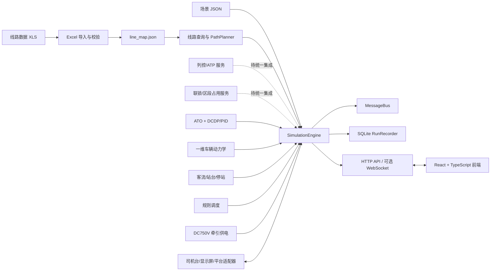

# 轨道交通综合仿真系统中期报告

副标题：匿名城市轨道线路多系统耦合仿真与优化研究平台

版本：v0.1（中期答辩参考稿）
日期：2026-07-10
代码基线：`main@84e7801`
项目代号：`Project RailSim`
项目成员：温灿、徐子涵、雷悦鸣、陈毓桥、马勇

## 0. 报告说明

本报告以 Git 仓库 `main` 分支的实际代码为主要依据，结合需求说明、软件设计、数据库/API 设计、供电专项调研、AI 优化问题文档和各成员分支历史，对项目截至 2026-07-10 的工作进行梳理。

报告对成果采用以下四种状态，避免把规划内容误写为已实现功能：

| 状态 | 含义 |
|---|---|
| 已实现并集成 | 已进入主程序运行链路，有 API、前端或自动测试证据 |
| 已实现待集成 | 算法/服务和测试已经存在，但尚未进入统一主引擎闭环 |
| 原型/工程近似 | 可以运行和演示，但参数、拓扑或业务规则仍需真实数据标定 |
| 已设计待实现 | 已有需求、模型、接口或算法方案，尚无对应可运行代码 |

当前各成员历史分支相对 `main` 均无独有提交，说明相关工作已经进入 `main`。`main` 分别领先 `frontend`、`cyq`、`feature/cab-plc-backend`、`feature/dynamics`、`mayong/feat` 53、47、52、55、1 个提交。由于开发期间存在直接在 `main` 修改、跨分支合并和多人共同修改同一文件的情况，本报告不把提交数量或代码行数作为个人工作量的唯一依据。

## 1. 项目概述

### 1.1 项目背景

项目面向城市轨道交通多专业协同仿真，使用经过变换的匿名线路场景数据和标准化接口，构建能够连接线路、车辆、列控、联锁、车站客流、调度和牵引供电的综合仿真平台。

项目不是只做线路动画，也不追求一次性复刻完整工业系统，而是采用“真实线路数据 + 可解释降阶模型 + 多系统闭环 + 可替换平台适配器 + 优化实验”的渐进路线：

1. 能从真实线路表建立轨道和设备数据基线。
2. 能让列车沿真实 Seg 路径运行，并受限速、坡度、控制和供电约束影响。
3. 能实现基本 ATP、联锁、客流、调度和供电逻辑。
4. 能通过宏观、微观、联锁、司机台和供电界面解释系统状态。
5. 后续能够围绕节能驾驶、供电峰值、再生利用、客流调度和扰动恢复开展 AI/智能优化实验。

### 1.2 当前项目定位

当前系统可定位为：

> 以匿名城市轨道线路场景为对象，面向功能验证和算法研究的多系统耦合仿真原型平台。

“教学与研究原型”意味着当前结果可以用于软件架构验证、规则验证、算法对比、故障场景分析和可视化演示，但不能替代运营单位的安全认证系统、施工图级供电计算或工业联锁设备。

### 1.3 中期结论

截至中期，项目已经形成可运行的 Phase 0/1 主体，并实现了部分 Phase 2 闭环：

- 真实 9 号线数据缓存已覆盖 319 条 Seg、60 组道岔、157 架信号机、13 座车站、56 个站台、374 个应答器、238 条静态限速、182 条坡度和 249 条进路。
- 单列车已可沿站间 Seg 路径运行，使用路径限速和坡度生成速度曲线，并由 ATO/PID 与一维动力学模型推进。
- 客流到达、上下客、列车负载、停站时间、规则调度和牵引供电已经进入主引擎 tick 链路。
- 基本列控、ATP 安全覆盖、区段占用、进路办理、道岔锁闭和信号解析已有独立服务及测试，其中信号/联锁尚待并入统一主引擎。
- 已自研 9 号线 DC750V 准静态牵引供电原型，包含 10 座 V0 牵引所、双边供电、馈电臂/接触轨/回流轨等效模型、N-1 故障、再生能量和电压/电流/负载输出。
- 前端已形成宏观、轨道、联锁、全线、驾驶、供电六类视图。
- 19 个规范自动测试模块共 183 项测试全部通过；前端 TypeScript 检查和 Vite 生产构建通过。

综合判断：Phase 0 基本完成，Phase 1 主体完成但安全链路仍需统一，Phase 2 已完成若干关键原型但尚未形成完整多车联锁闭环，Phase 3 已完成问题设计和算法储备，尚未进入系统化实验阶段。

## 2. 需求、数据与调研基础

### 2.1 需求体系

现有需求说明将系统规范化为 12 个模块：

| 编号 | 模块 | 当前研究重点 |
|---|---|---|
| M1 | 线路与轨道仿真 | 真实电子地图、Seg 拓扑、限速、坡度、站台和设备查询 |
| M2 | 车辆动力学仿真 | 一维动力学、牵引/制动、载荷、停车与能耗 |
| M3 | 牵引供电仿真 | DC750V 网络、潮流、欠压/过载、再生利用和故障供电 |
| M4 | 信号与列控仿真 | MA、允许速度、ATP 监督、区段占用和信号状态 |
| M5 | 司机台/驾驶行为仿真 | 手动/ATO 模式、PLC 输入输出、ATP 覆盖和驾驶显示 |
| M6 | 车站与站台仿真 | 候车、上下客、负载、停站时间和门状态 |
| M7 | 调度与运行图仿真 | 客流/负载/供电约束下的扣车、放行和调整 |
| M8 | 环境与扰动仿真 | 临时限速、车门、信号、供电和大客流故障 |
| M9 | 通信接口与数据交换 | 内部消息、HTTP/WS、实验室平台和设备协议适配 |
| M10 | 仿真时钟与场景管理 | 固定步长、生命周期、场景配置和可重复运行 |
| M11 | 数据记录、评估与回放 | SQLite 记录、指标、事件、导出和实验对比 |
| M12 | 可视化与人机交互 | 宏观线路、轨道级、联锁、司机台、供电和 KPI |

### 2.2 线路数据成果

老师提供的 `线路数据(1).xls` 共 33 个工作表。当前缓存 `data/cache/line_map.json` 已包含：

| 对象 | 数量 | 当前用途 |
|---|---:|---|
| Seg | 319 | 路径规划、列车定位、联锁和轨道视图 |
| 计轴区段 | 259 | 区段占用与进路安全检查 |
| 逻辑区段 | 386 | 后续 MA/闭塞深化 |
| 道岔 | 60 | 路径分支、道岔要求和锁闭 |
| 信号机 | 157 | 信号显示、进路始终端和 MA 约束 |
| 车站/站台 | 13/56 | 运行任务、停车和客流服务 |
| 应答器 | 374 | 后续定位/点式列控扩展 |
| 坡度/静态限速 | 182/238 | ATO 路径约束和车辆动力学输入 |
| 进路 | 249 | 进路目录、冲突关系和信号开放 |
| 保护区段 | 49 | 联锁安全检查扩展 |

数据导入报告当前为 0 error、0 warning，但仍有一个需要优先修复的数据问题：调研报告确认原表存在 297 个点，当前缓存中的 `points` 数组却为 0。说明导入器对“点表”的解析或表名/有效区域识别仍有缺口，当前系统主要依赖 Seg 自带引用运行。坡度编码单位、`0x55/0xaa` 方向编码和部分设备类型编码也仍需老师确认。

### 2.3 平台接口边界

团队已通读学校实验室多系统平台接口协议，确定采用“自研模块优先，成本过高或已有平台能力时通过适配器替换”的原则。协议可支撑部分司机台、网络屏、信号屏和车辆/平台数据交换，但没有可直接调用的完整牵引供电潮流接口，因此供电模块采用自研准静态模型。

当前已实现二进制字段读写、TCP 定长帧客户端、三菱 PLC 司机台解析/反馈、网络屏和信号屏帧构造。由于尚未连接真实实验室硬件，当前只能声明为“协议级实现并通过本地帧测试”，不能声明为“已完成设备联调”。

### 2.4 专项调研与算法储备

已完成或形成的主要研究文档包括：

- 前八个业务模块的互联网需求调研方法和多个模块需求调研报告。
- 车辆动力学与牵引供电的 10 个备选优化问题。
- 车辆/供电 AI 优化方法，包括 GA、PSO、贝叶斯优化、预测模型、强化学习和鲁棒优化。
- 其他模块 16 个 AI 问题，以及动态追踪间隔、客流预测调度、扰动运行图重排三条推荐主线。
- 9 号线供电拓扑、电气参数、列车负荷、再生能量、N-1 约束和公开验证数据专项调研。
- 5 篇供电与能耗相关论文资料，覆盖 DC 牵引供电、潮流与损耗、列车能耗、再生利用和运行图优化。
- 9 号线 OD 矩阵与换乘客流调研报告（当前为本地新增资料，尚未提交到 `main`），提出 AFC、ATS、视频融合、合成 OD/IPF 和乘客批次方案。

这些成果已经把“之后可以做 AI”转化为可定义决策变量、目标函数、约束和评价指标的研究问题，但当前还没有完成通用 `ExperimentRunner`、批量参数搜索和优化前后统计检验。

## 3. 总体架构

### 3.1 技术架构



### 3.2 后端分层

| 层 | 目录 | 作用 |
|---|---|---|
| 核心编排层 | `app/core` | 仿真时钟、消息总线、场景、主引擎 |
| 领域层 | `app/domain` | 线路、车辆、ATO、列控、联锁、车站、调度和供电 |
| 适配层 | `app/adapters` | PLC、网络屏、信号屏、TCP 定长帧通信 |
| 基础设施层 | `app/infra` | Excel 导入、校验和 SQLite Recorder |
| 接口层 | `app/api_server.py` | HTTP API、CORS、WebSocket 推送入口 |
| 演示层 | `app/domain/operations` | 成员 C/D 分阶段独立演示和测试场景 |

主引擎采用 0.25 秒固定步长场景，即 4 Hz。需求文档中“第一阶段不低于 10 Hz”的目标目前未达到，需要在性能优化后调整，或由团队重新确认教学仿真的频率验收口径。

### 3.3 前端架构

前端技术栈为 React 19、TypeScript、Vite、Zustand、MapLibre、Ant Design 和 Tailwind CSS。`App.tsx` 负责后端连接、线路数据加载、状态轮询和六种主视图切换，`useSimStore` 维护统一前端状态。

当前六个视图为：

| 视图 | 主要内容 | 动态数据情况 |
|---|---|---|
| 宏观 | 北京地铁线路图、9 号线列车位置、牵引所标记、KPI 与闭环侧栏 | 接入主引擎状态 |
| 轨道 | 9 号线站点里程、Seg/信号/站台/进路统计、牵引所和列车电压 | 静态拓扑 + 主引擎供电状态 |
| 联锁 | 单站 Canvas 联锁图、轨道/信号/道岔/进路检查器 | 以静态站图为主 |
| 全线 | 13 站连续联锁图、缩放/拖拽、列车动画 | 联锁底图主要为前端建模，列车状态轮询中 |
| 驾驶 | 速度表、站序、控制按钮、牵引/制动、计划/实际速度曲线、Seg/坡度 | 接入主引擎和 ATO |
| 供电 | 牵引所/馈电臂/列车电压、功率能量曲线、告警、N-1 和开关操作 | 接入供电潮流与故障 API |

### 3.4 主引擎运行顺序

当前每个 tick 的主要顺序是：

```text
仿真时钟推进
  -> ATO 与车辆动力学更新列车
  -> 站台客流到达累积
  -> 牵引供电潮流与牵引限制更新
  -> 规则调度决策
  -> MessageBus 发布列车/时钟状态
  -> SQLite 记录事件、调度、供电和指标
  -> 生成 API/前端快照
```

需要注意，供电限制本 tick 计算后主要影响后续 tick 的车辆牵引；信号/ATP 与联锁服务尚未加入上述统一顺序。

## 4. 分阶段完成情况

以下百分比是基于需求条目、主引擎集成和验证证据的中期估算，仅用于进度管理，不作为个人评分依据。

| 阶段 | 估算完成度 | 已形成成果 | 主要缺口 |
|---|---:|---|---|
| Phase 0 数据基线与工程框架 | 85% | 线路缓存、查询、路径规划、时钟、消息总线、Recorder、前后端基础接口 | 点表未导入、部分编码/坡度单位未确认、静态库仍以 JSON 为权威源 |
| Phase 1 单车运行与安全约束 | 75% | 一维动力学、ATO、路径速度曲线、司机台、PLC 协议、列控/ATP 服务、运行曲线 | ATP 未进入主引擎；车辆模型阻力/黏着/载荷仍简化；停车与舒适度尚未系统标定 |
| Phase 2 多车联锁客流供电调度 | 55% | 联锁服务、区段占用 Demo、客流/停站/负载、规则调度、供电潮流、N-1、六视图 UI | 主引擎仍以单车场景为主；联锁未闭环；OD/运行图/扰动未完成；载客质量未反馈车辆质量 |
| Phase 3 AI 优化与实验 | 15% | 优化问题、目标函数、算法路线、DCDP 速度曲线优化基础 | 缺 ExperimentRunner、批量试验、AI 算法实现、统计对比和 Pareto 页面 |

当前最准确的总体表述是：

> 系统已完成真实线路数据驱动的单车多系统仿真主链路，并完成联锁、多车、供电和调度的关键 Phase 2 原型；下一阶段重点是把现有独立能力收敛为统一安全闭环，并建立可重复的优化实验框架。

## 5. 十二模块实现状态

| 模块 | 状态 | 当前实现 | 关键缺口 |
|---|---|---|---|
| M1 线路与轨道 | 已实现并集成 | XLS/缓存导入、319 Seg 查询、路径规划、限速/坡度约束、宏观/微观展示 | `points=0`；道岔分支路径和工程编码需复核 |
| M2 车辆动力学 | 已实现并集成 | 一维牛顿模型、牵引/制动/紧急制动、阻力、坡度力、供电限牵、能耗 | 基本阻力为常数；载客质量未写回车辆质量；缺黏着和响应延迟标定 |
| M3 牵引供电 | 原型已集成 | 10 座牵引所 V0、双边供电、馈电/接触轨/回流轨、移动负荷、N-1、再生与损耗 | 拓扑为工程估计；未完成 8.8/10.5MWh 日电量校准；未建 AC 中压侧 |
| M4 信号与列控 | 已实现待集成 | 静态/信号限速、MA、超速/越权检测、ATP 覆盖、安全事件 | 未进入主引擎；动态前车尾 MA、点式/CBTC 模式和联锁信号源待接入 |
| M5 司机台/驾驶 | 已实现并集成 | 手动/ATO 命令模型、PID 控制、速度曲线、司机台 UI、PLC 输入输出帧 | 实物 PLC 未联调；驾驶风格和异常驾驶识别待实现 |
| M6 车站与站台 | 原型已集成 | 确定性客流到达、候车密度、上下客、滞留、负载率和停站时间 | 固定下车比例；门/屏蔽门设备状态简化；OD 与换乘未实现 |
| M7 调度与运行图 | 原型已集成 | 按供电、追踪间隔、拥挤、满载和扰动生成 HOLD/RELEASE/STAGGER 等决策 | 主场景缺真实多车 headway；缺运行图对象、短线/跳停执行和重排算法 |
| M8 环境与扰动 | 已设计待实现 | 供电 N-1 可人工注入，门故障参数和扰动字段已有接口预留 | 缺统一 EnvironmentService、临时限速/信号/大客流事件生命周期和恢复传播 |
| M9 通信与交换 | 部分实现 | MessageBus、24 个 GET/POST 路由模式、可选 WS、PLC/网络屏/信号屏 TCP 帧 | API 文档大于当前实现；平台健康管理、重连、真实设备对接待验证 |
| M10 时钟与场景 | 已实现并集成 | LOADED/RUNNING/PAUSED/STOPPED、0.25s tick、JSON 场景、后台线程 | 4 Hz 未达需求目标 10 Hz；多场景/随机种子/批量实验不足 |
| M11 记录评估回放 | 部分实现 | SQLite 16 张表，记录事件、客流、负载、停站、调度、供电和再生 | 列车遥测/控制命令专表、回放 API、导出 API 和实验汇总库未完成 |
| M12 可视化交互 | 已实现并集成 | 六视图、KPI、速度曲线、全线联锁、供电故障控制和告警 | 部分联锁图是静态模型；前端包较大；缺统一事件时间轴和实验对比页 |

## 6. 关键技术成果

### 6.1 真实 Seg 路径驱动的 ATO 与车辆闭环

车辆不再只按站间直线距离或恒加速度动画推进。当前 `PathPlanner` 根据起终站建立 Seg 序列和位置约束，速度曲线模块读取路径上的局部限速与坡度，DCDP 生成规划曲线，ATO 使用 PID 跟踪目标速度，`SimpleVehicleModel` 再根据牵引、制动、阻力、坡度和供电限制更新位置/速度。

前端驾驶视图同时显示计划速度曲线和实际速度曲线，并显示当前 Seg、路径位置、局部限速、坡度、牵引/制动百分比和累计能耗。这一链路是当前系统最完整的“算法到可视化”成果之一。

当前 DCDP 属于可解释优化算法和 Phase 3 的基础，不应直接宣传为已经完成 AI。后续可在其参数、目标函数和工况外层加入 GA/PSO/贝叶斯优化，形成真正的批量智能寻优。

### 6.2 基本列控与 ATP 安全覆盖

成员 C 已实现 `TrainControlService`、`SafetyGuard` 和安全事件收集：

- 综合静态限速、场景最大速度和信号显示计算允许速度。
- 根据目标停车点和红灯位置计算简化 MA 终点。
- 检测超速和越过 MA。
- 当 ATP 请求紧急制动时覆盖 ATO/人工命令。
- 保留已有紧急制动，或在超速时切断牵引并施加安全命令。

该部分有较细的边界测试，但需要把服务接入主引擎，并让联锁信号解析器成为动态信号源，才能形成真正的运行时安全链。

### 6.3 计算机联锁与区段占用

已实现的联锁能力包括：

- 从 249 条进路构造 `RouteCatalog`。
- 根据共同区段和道岔要求推导敌对进路。
- 根据列车头部和 120m 车长回溯列车尾部占用范围。
- 办理进路前检查区段占用、敌对进路和道岔可用性。
- 锁闭/解锁道岔，维护进路生命周期和自动释放。
- 根据信号故障、进路锁闭和后续信号解析红/黄/绿状态。

成员 C 的独立 Demo 使用 3 列车沿主干 Seg 链运行并展示计轴区段占用。当前回溯和 Demo 路径对道岔分支采用简化主干规则，全线前端联锁底图也尚未直接消费 `RouteService` 的动态状态。

### 6.4 客流、负载、停站与规则调度

主引擎已接入以下闭环：

```text
时变到达率
  -> 站台候车人数与密度
  -> 列车到站上下客、滞留人数和负载率
  -> 停站时间修正
  -> 调度规则读取拥挤、满载、headway、供电限制和扰动
  -> HOLD / RELEASE / STAGGER_DEPARTURE / ADD_TRAIN_REQUEST 等决策
  -> 前端 KPI 和 SQLite 记录
```

当前客流是确定性的站级到达率模型，便于测试复现，但固定下车比例不能描述 OD、换乘和断面客流。下一阶段应优先采用“合成 OD + 乘客批次 + 按目的地下车”，再等待 AFC/视频数据标定。

### 6.5 自研 DC750V 牵引供电仿真

由于学校平台协议没有完整供电潮流接口，团队基于公开资料和论文建立了 9 号线工程近似模型：

- 10 座牵引变电所，郭公庄作为公开信息锚点，其余位置为 V0 工程近似。
- 空载电压、等效内阻、额定/过载电流、馈电臂、接触轨和回流轨参数。
- 列车作为随位置移动的牵引恒功率负荷或再生源。
- 相邻牵引所双边供电、电压/电流分配、牵引所和馈线负载、线路损耗。
- 同网牵引列车优先吸收再生能量，剩余由 EFS 或浪费项处理。
- 欠压时输出 `tractionLimitRatio`，反馈给车辆牵引。
- 支持单牵引所 N-1 退出、馈线打开、联络开关闭合与网络恢复。
- API 和专用供电页面展示列车电压、变电所功率、馈电臂、能量和告警。

供电输出统一标记为 `source=SELF_SIM`、`quality=ENGINEERING_ESTIMATE`。这是当前模型可信度边界的一部分，也是答辩时应主动说明的工程规范。

### 6.6 数据记录与可追溯性

`RunRecorder` 当前建立 16 张 SQLite 表：

```text
runs, events, metrics,
station_passenger_records, train_load_records, dwell_records,
dispatch_decisions, power_records,
traction_substations, feeder_arms, contact_rail_sections,
return_rail_sections, power_switches,
train_voltage_records, substation_power_records, regen_energy_records
```

每次仿真可记录运行批次、事件、客流、负载、停站、调度、供电拓扑、列车电压、牵引所功率和再生能量。完整回放、通用导出和 Phase 3 实验汇总仍属于后续工作。

## 7. API 与系统可运行性

### 7.1 当前主要 API

后端当前实现的接口覆盖：

- 健康检查、9 号线宏观数据、站点、轨道拓扑和 Seg 上下文。
- 仿真状态、速度曲线、启动、暂停、恢复和停止。
- 供电拓扑、供电状态、N-1 故障、网络复位和开关操作。
- 成员 C/D 分阶段 Demo、状态、单步和复位。

API 设计文档还规划了车辆命令、MA/ATP、完整联锁、客流、调度、扰动、平台健康、运行回放和优化实验接口。当前实现只是其中的 Phase 0/1 和部分 Phase 2 子集，应继续按文档逐步实现，不能把设计接口当作已上线接口。

### 7.2 当前启动方式

后端：

```powershell
cd <repository-root>
python -m app.api_server --host 127.0.0.1 --port 8000
```

前端：

```powershell
cd <repository-root>\bj-metro-sim
npm install
npm run dev
```

访问 `http://localhost:5173/`。WebSocket 依赖未安装时后端会跳过 WS 服务，前端仍可通过 HTTP 轮询运行。

## 8. 五位成员工作梳理

### 8.1 成员 A：温灿（Git：`20INNEW` / `ERROR65536`，分支：`frontend`）

原定主责：线路数据、仿真内核、记录回放。
实际重点：前端基础框架、线路数据加载、主引擎与车辆闭环集成，并承担部分原定成员 E 的前端工作。

主要成果：

- 建立前端项目基础和北京地铁线路展示，统一使用高德/静态线路数据并设计静态文件、缓存、API 三级加载策略。
- 实现动态站点、线路筛选、换乘标签、弹窗、宏观/轨道视图切换和前端状态管理。
- 增加仿真时钟、场景系统、主引擎、增强 API 和前端生命周期控制。
- 将成员 B 的 ATO/车辆模型接入主引擎，形成站间运行、速度曲线生命周期和司机台曲线展示。
- 完成多线路选择、Canvas 联锁容器、司机台页面和视图过渡。
- 处理多次跨分支冲突，保证主引擎和前端状态模型能够共同演进。

代表性提交：`4a8d9ae`、`87dfc6a`、`eb2ba1b`、`6ac2eb1`、`61ebd29`、`f18647c`。
下一步建议：修复点表导入；把成员 C 安全/联锁服务编排进主引擎；完善随机种子、回放和运行导出；优化前端包体。

### 8.2 成员 B：徐子涵（Git/仓库拥有者：`misaka16483`，提交标识：`23341069`，分支：`feature/cab-plc-backend`、`feature/dynamics`）

原定主责：车辆动力学、ATO、司机台控制、车辆平台对照。
实际工作与原定职责基本一致。

主要成果：

- 实现 `VehicleConfig`、`TrainState`、`ControlCommand` 和一维车辆动力学推进。
- 实现 ATO 自动停车控制、司机台控制合成和手柄级位映射。
- 实现离散连续动态规划（DCDP）速度曲线、PID 跟踪和规划曲线诊断。
- 将速度曲线升级为 PathPlan-aware，读取真实 Seg 路径、局部限速和坡度。
- 根据 Seg 生成站间路径并接通主引擎、API 和司机台前端。
- 实现三菱 PLC 司机台输入/输出协议与 TCP 客户端骨架，为后续硬件联调预留接口。
- 补充车辆动力学、ATO、司机台和 PLC 适配器测试及说明文档。

代表性提交：`0e2892f`、`bdcfcda`、`103870b`、`6bd6c58`、`3ff26ba`、`bed2b43`。
下一步建议：将乘客质量写入车辆总质量；增加速度相关 Davis 阻力、牵引/制动力曲线、黏着和制动延迟；用真实/平台数据标定；为 GA/PSO/BO 暴露 ATO 参数。

### 8.3 成员 C：雷悦鸣（Git：`leiyueming6-stack`，提交标识：`鼠鼠我啊`，部分工作位于 `cyq`）

原定主责：信号列控、计算机联锁、区段占用、扰动安全约束。
实际工作已完成列控/联锁主体算法，扰动模块尚未展开。

主要成果：

- 实现列控状态模型、允许速度计算、MA 终点、超速/越权判断、ATP 紧急制动和命令安全覆盖。
- 实现计轴区段占用，考虑列车头部位置和车尾回溯。
- 从真实进路表构造进路目录，并推导区段冲突和道岔冲突。
- 实现道岔锁闭、联锁规则检查、进路办理/取消/释放和信号解析。
- 建立 3 列车区段占用 Demo 及 Phase 1/2 大量边界测试。
- 在合并过程中统一成员 B/D 的 TrainState 和接口数据结构，并补充线路导入/联锁所需字段。

代表性提交：`22ec598`、`366fdbb`、`124cc87`。
下一步建议：将列控和联锁加入主引擎 tick；让前端联锁图读取动态进路/占用/信号状态；实现统一 EnvironmentService 和临时限速/信号故障传播；完善道岔分支上的车尾回溯。

### 8.4 成员 D：陈毓桥（Git：`parschen` / `BillYuqiaoChen`，分支：`cyq`）

原定主责：车站客流、调度运行图、供电自研模型、优化基线。
附加承担：需求/设计/API/数据库文档、前后端集成、多分支冲突处理和主分支发布。

主要成果：

- 完成线路表分析、模块化需求、需求调研指导、软件设计、数据库设计、API 设计、成员分工和优化问题系列文档。
- 实现站台客流、上下客、列车负载、停站时间、规则调度和早高峰 Demo。
- 将成员 D 的客流-负载-停站-供电-调度指标接入主引擎和前端闭环面板。
- 根据平台协议缺少供电潮流能力的事实，组织供电专项调研，形成 V0 拓扑、参数、准静态潮流和实施任务书。
- 实现 10 座牵引所供电网络、DC 潮流、馈电臂/接触轨/回流轨、再生能量、损耗、N-1 故障和限牵反馈。
- 扩展 SQLite 供电记录、供电 API、宏观牵引所标记、微观供电信息和独立供电监控页面。
- 多次合并 `frontend`、`mayong/feat`、`feature/cab-plc-backend`、`cyq` 与 `main`，手工处理冲突并统一 API/数据库契约。

代表性提交：`49e2f24`、`fbcf3c0`、`54f7947`、`59eef23`、`da2f7ea`、`7d9c22e`、`84e7801`。
下一步建议：实现合成 OD/乘客批次；使载荷反馈车辆质量；用多车场景驱动 headway 调度；完成供电校准、守恒误差和 N-1 高峰验证；实现 Phase 3 实验运行器和多目标评价函数。

### 8.5 成员 E：马勇（Git：`my6014`，提交标识：`Emanon.`，分支：`mayong/feat`）

原定主责：后端 API、前端接入、双层界面、平台状态展示。
实际重点：车站联锁图和全线连续联锁可视化，与成员 A/D 的前端/API 工作形成互补。

主要成果：

- 设计并实现车站级联锁图视觉原型，展示轨道、站台、信号机、道岔、进路和列车图形。
- 扩展 13 座车站的前端联锁数据和站点选择。
- 实现 9 号线连续全线联锁图，将各站图按站间里程拼接。
- 实现全线画布缩放、拖拽和列车动画 Demo。
- 提供《全线连续联锁图设计方案》，说明布局、定位、数据流和分阶段实施。

代表性提交：`39d1990`、`9a93f96`、`d5c9f75`、`c6083d9`、`e4db1a0`、`f592f21`、`b2d864d`。
下一步建议：让联锁图从后端 RouteService/SectionOccupationService 获取动态状态；统一静态图 ID 与线路表 ID；补充进路办理交互、故障状态、接口健康面板和答辩演示脚本。

### 8.6 协作评价

团队已经完成多次跨分支合并，五个成员分支中的提交均已进入 `main`。当前主要协作问题不是“功能是否有人做”，而是同一功能常由多人在同一文件中直接集成，导致分支职责和 Git 作者不能完全代表真实贡献。后续应减少直接在 `main` 开发，使用短周期功能分支和 PR，并在 PR 中列出跨模块契约、测试和演示步骤。

## 9. 工程质量与验证

### 9.1 代码规模

截至代码基线：

| 指标 | 数值 |
|---|---:|
| Python 文件（`app` + `tests`） | 84 |
| 前端 TS/TSX 文件 | 24 |
| Python 代码/测试行数 | 约 13,697 |
| 前端 TS/TSX 行数 | 约 6,787 |
| SQLite 已实现表 | 16 |
| 规范自动测试模块 | 19 |
| 自动测试方法 | 183 |

代码行数只用于描述工程规模，不用于评价个人贡献。

### 9.2 自动测试结果

2026-07-10 在 `main@84e7801` 上执行 19 个规范测试模块：

```text
Ran 183 tests in 106.087s
OK
```

覆盖内容包括：线路单位转换和查询、路径规划、仿真时钟、消息总线、Recorder、车辆动力学、ATO/DCDP、PLC、显示屏协议、列控/ATP、联锁/区段占用、客流/调度/供电、DC 潮流、N-1 和主引擎供电闭环。

`tests/test_engine_api.py` 和 `tests/test_engine_long.py` 是需要预先启动 8000 端口后端的手工联调脚本，文件名虽然以 `test_` 开头，但不属于规范 `unittest.TestCase`。后续应移至 `scripts/manual` 或改造成可自动启动/停止服务的集成测试，避免 `unittest discover` 误导和超时。

### 9.3 前端构建结果

执行 `npm run build` 成功，TypeScript 编译和 Vite 生产构建通过。当前主 JS chunk 约 1.37MB（gzip 约 369KB），Vite 给出超过 500KB 的包体警告。该问题不阻塞中期演示，但后续应按视图使用动态 import 分包。

### 9.4 当前质量边界

- 自动测试证明规则和接口在已有场景下可重复运行，不等同于工业安全认证。
- 供电拓扑和参数为工程近似，必须保留质量标签。
- 主引擎为单进程、内存总线和本地 SQLite，适合当前开发和可重复实验，现阶段没有必要为此建立云数据库。
- 前端主要通过 200ms HTTP 轮询更新；WebSocket 为可选能力，尚未作为唯一实时链路。

## 10. 当前问题与风险

| 优先级 | 问题 | 影响 | 建议措施 |
|---|---|---|---|
| P0 | 信号/ATP/联锁未进入主引擎 | 当前列车运行不会真正被动态进路和 ATP 统一约束 | 在 `_tick` 中加入占用更新、进路/信号解析、MA/ATP、SafetyGuard 顺序 |
| P0 | `line_map.json` 点表为 0 | 拓扑完整性和设备坐标语义存在隐患 | 修复导入器并增加“297 点”验收测试 |
| P0 | 主引擎主要为单车场景 | headway、冲突进路、再生互补和调度难以真实验证 | 建立至少 3 列车统一场景，合并成员 C Demo 与主引擎列车状态 |
| P0 | 客流负载未影响车辆总质量 | 客流-车辆-供电耦合不完整 | 由 TrainLoadState 计算载荷质量并传入 VehicleConfig/运行状态 |
| P1 | 客流采用固定下车比例 | 无法形成 OD 守恒、换乘和断面客流 | 实现合成 OD、PassengerCohort 和按目的地下车 |
| P1 | 供电模型未校准 | 电压、能耗和再生比例只能用于趋势分析 | 做功率/能量守恒测试，并用郭公庄公开电量和典型工况校准 |
| P1 | 扰动模块缺失 | 无法完整演示故障传播和恢复调度 | 建立统一扰动状态机，先实现临时限速、门故障、信号故障、大客流 |
| P1 | 4 Hz 未达到需求文档 10 Hz | 存在非功能需求不一致 | 评估 DCDP 缓存和潮流耗时，明确实时展示与离线优化两种步长 |
| P1 | API 设计多于实现 | 前后端成员可能按不同契约开发 | 在 API 文档增加“实现状态”列或生成 OpenAPI/契约测试 |
| P2 | 前端部分联锁数据为手工建模 | 可能与线路表 ID、实际状态不一致 | 后端生成前端图数据，静态布局只保存几何信息 |
| P2 | 手工测试混入自动发现目录 | 完整测试容易超时或依赖本机服务 | 移动脚本并建立真正的端到端测试夹具 |
| P2 | 真实平台/PLC 未联调 | 协议字节级实现无法证明网络与设备兼容 | 预约实验室联调，保留抓包、帧样例和异常重连记录 |

## 11. 下一阶段实施计划

### 11.1 第一优先级：统一安全闭环

目标：让主引擎中的列车真正受区段占用、进路、信号、MA 和 ATP 约束。

验收条件：

1. 同一主引擎至少运行 3 列车。
2. 列车头尾正确占用计轴区段。
3. 占用区段或敌对进路时办理请求被拒绝。
4. 进路锁闭后信号才能开放。
5. 红灯、超速或越过 MA 时 SafetyGuard 覆盖 ATO 并紧急制动。
6. 前端全线联锁图同步显示列车、占用、进路和信号状态。

建议协作：成员 C 主责安全服务接入，成员 A 主责引擎编排，成员 E 主责动态联锁 UI，成员 B 处理 ATP 命令与车辆模型接口，成员 D 处理 API/记录和集成测试。

### 11.2 第二优先级：客流-车辆-调度闭环深化

目标：把站级到达率升级为守恒的 OD 客流，并让客流同时影响车辆质量、停站和调度。

验收条件：

1. 导入 13×13、5 分钟粒度的合成 OD。
2. 使用乘客批次按目的地下车，满足人数守恒。
3. 至少模拟北京西站/军事博物馆两个换乘边界。
4. 载客质量改变加速度、区间时间和供电需求。
5. 规则调度能根据候车、滞留、满载率和 headway 产生可执行调整。
6. 前端展示 OD 质量标签、断面客流和调整前后指标。

建议协作：成员 D 主责 OD/调度，成员 B 主责载荷动力学，成员 A 主责场景/记录，成员 C 校验最小追踪与安全约束，成员 E/A 补充可视化。

### 11.3 第三优先级：供电校准与故障实验

目标：把“能算”提升为“数值趋势可解释、故障结论可复现”。

验收条件：

1. 检查每 tick 功率平衡和累计能量平衡，给出允许误差。
2. 正常工况列车受电电压主要落在 640-900V，硬约束不低于 500V。
3. 校准郭公庄牵引电量约 8.8MWh/day、工作日约 10.5MWh/day、回馈电量约 0.8-1.0MWh/day；若场景规模不同，给出等比例换算。
4. 建立正常、单馈线故障、单牵引所 N-1、大客流高峰四个对比场景。
5. 至少识别一类欠压、过载或再生浪费风险，并展示限牵/错峰策略效果。

建议协作：成员 D 主责潮流和场景，成员 B 主责列车负荷，成员 A 主责批量运行和记录，成员 C 负责故障安全约束，成员 E/A 完善告警时间轴。

### 11.4 第四优先级：Phase 3 优化实验

推荐第一条 AI/智能优化主线：

> 供电约束下的列车自动停车与节能多目标优化。

原因：当前已有 Path-aware ATO、速度曲线、车辆能耗、供电电压/峰值/再生和 SQLite 记录，数据链最完整，改造成本最低。

建议决策变量：ATO PID 参数、惰行起点、制动起点、运行时间裕度、再生/机械制动分配和牵引功率上限。
建议目标：停车误差、净能耗、峰值牵引所功率、运行时间偏差、最大 jerk。
建议约束：限速、MA、联锁、受电电压、牵引/制动互斥、停车边界和运行图时间窗。
建议算法：先网格/随机搜索建立基线，再使用 NSGA-II/PSO/贝叶斯优化；强化学习作为扩展，不作为第一版主线。

必须新增：`ExperimentRunner`、场景随机种子、参数配置、批量运行、指标汇总、基线/优化对比和 Pareto 图。

## 12. 中期答辩演示建议

### 12.1 8-10 分钟演示流程

| 时间 | 演示内容 | 要说明的技术点 |
|---:|---|---|
| 0:00-1:00 | 项目定位与架构 | 真实 9 号线、多系统闭环、研究型平台，不是单纯动画 |
| 1:00-2:00 | 宏观线路图 | 线路、列车位置、牵引所、KPI 和 API 在线状态 |
| 2:00-4:00 | 驾驶视图启动仿真 | Seg 路径、局部限速/坡度、DCDP 计划曲线、PID 实际曲线、车辆动力学 |
| 4:00-5:00 | 轨道/联锁视图 | 319 Seg 等真实数据规模、车站联锁和全线连续图 |
| 5:00-6:30 | 客流/调度闭环 | 候车、上下客、负载、停站和调度决策 |
| 6:30-8:00 | 供电专用界面 | 10 座牵引所、电压/功率/馈电、N-1 注入和恢复 |
| 8:00-9:00 | 测试与工程质量 | 183 测试通过、SQLite 16 表、API/平台适配边界 |
| 9:00-10:00 | 问题与后续 | 统一联锁安全闭环、OD、多车、供电校准和 AI 优化主线 |

### 12.2 演示前检查清单

1. 后端启动日志显示场景加载成功、1 列车、13 站和 SQLite 路径。
2. 前端显示 `API CONNECTED`，不使用 fallback 数据完成关键演示。
3. 先执行一次停止/供电复位，避免上次 N-1 状态残留。
4. 驾驶视图确认规划速度曲线与路径长度匹配。
5. 供电视图先展示正常工况，再注入一个中间牵引所 N-1，最后恢复网络。
6. 准备成员 C 独立 Demo/API 的截图或录屏，说明联锁算法已实现待主引擎集成。
7. 准备离线录屏，防止答辩现场端口、依赖或地图网络异常。

### 12.3 建议答辩主线

答辩叙述应围绕一个闭环展开：

```text
真实线路约束
  -> ATO 决策
  -> 车辆动力学
  -> 位置/速度/能耗
  -> 客流与载荷
  -> 牵引供电电压和限牵
  -> 调度决策
  -> 前端监控与数据记录
  -> 后续智能优化
```

不要按“我们做了很多页面”逐页介绍。页面是验证和解释算法的手段，核心价值是统一状态和约束在闭环中传递。

## 13. 中期答辩可能问题与参考回答

### 13.1 你们项目与普通地铁线路动画有什么区别？

普通动画主要按时间改变图标位置。本项目的列车状态由真实 Seg 路径、局部限速、坡度、ATO、车辆动力学、客流载荷和供电限制共同决定，同时有联锁/ATP 安全服务、SQLite 记录和故障接口，因此重点是多系统状态和约束的闭环，而不是单纯视觉移动。

### 13.2 为什么供电系统要自研？

学校接口协议没有提供完整牵引供电潮流接口。项目先查阅 9 号线公开资料和 DC 牵引供电论文，建立 10 座牵引所的 V0 工程近似模型，并明确标记 `ENGINEERING_ESTIMATE`。若后续获得真实 PSCADA 或图纸数据，可以替换拓扑和参数，不需要重写车辆、调度和前端接口。

### 13.3 10 座牵引所和具体位置是真实的吗？

公开资料支持早期工程设置 10 座地下牵引变电所，郭公庄有较强公开信息支撑；其余具体位置和分段缺少施工图，因此当前按车站里程和供电半径近似布点。数量和模型结构有工程依据，精确位置是 V0 假设，后续需要校准。

### 13.4 目前是否已经使用人工智能？

当前已经实现路径约束下的 DCDP 速度曲线优化和 PID 跟踪，并完成多类 AI 优化问题设计，但还没有把 GA、PSO、贝叶斯优化或强化学习接入通用实验框架。因此准确说法是“优化基线和数据闭环已具备，AI 批量寻优是下一阶段工作”，而不是宣称 AI 已完成。

### 13.5 为什么不用云数据库？

当前系统是单机高频仿真和可重复实验，本地 SQLite 部署简单、延迟低、便于每次运行独立归档，已能覆盖当前 16 张表。云数据库不会直接提高仿真精度，反而增加网络和运维变量。多人共享实验、Web 部署或大规模结果检索时再迁移 PostgreSQL 更合理。

### 13.6 信号和联锁是否真正控制了主列车？

目前列控/ATP、进路、道岔锁闭、区段占用和信号解析已经有独立实现和测试，但尚未全部进入主引擎 tick。主列车当前主要受路径限速、ATO、车辆和供电控制。把现有安全服务并入主循环是下一阶段最高优先级，团队不会把“算法已实现”混同为“主闭环已完成”。

### 13.7 客流数据是否真实？

当前主引擎使用可重复的合成站级到达率，不代表真实 9 号线客流。团队已经完成 OD/AFC/视频融合调研，下一步先做带 `SYNTHETIC` 质量标签的合成 OD 和乘客批次，再在取得脱敏 AFC 或人工计数后标定。

### 13.8 当前最有含金量的三点是什么？

1. 真实 9 号线 Seg、限速、坡度和进路数据进入算法，而不是只做站点坐标动画。
2. ATO/车辆、客流/调度和自研供电已经形成主引擎闭环，并可在司机台和供电页面解释。
3. 联锁/ATP、供电 N-1、PLC/显示屏协议和 183 项自动测试构成了可深化的工程基础。

## 14. 中期成果清单

### 14.1 可运行软件

- Python 仿真后端、HTTP API 和可选 WebSocket。
- React/TypeScript 可视化前端。
- 9 号线线路缓存和场景数据。
- 车辆动力学、ATO、列控/ATP、联锁、客流、调度和供电领域服务。
- PLC、网络屏和信号屏协议适配器。
- SQLite 运行记录数据库。
- 成员 C/D 独立演示程序和自动测试。

### 14.2 核心文档

- 线路数据表格分析报告。
- 前八模块需求调研指导及多个模块调研报告。
- 轨道交通综合仿真系统需求说明书。
- 完整软件设计、后四个支撑模块设计、API 设计和数据库设计。
- 前端双层界面和全线连续联锁图设计。
- 五人分工与执行规范。
- 车辆/供电备选优化问题、AI 方法和其他模块 AI 问题调研。
- 9 号线牵引供电调研、仿真方案和实施任务书。
- 9 号线 OD 与换乘客流调研（本地待提交）。

## 15. 结论

项目中期最重要的成果，是已经从“模块设想和文档设计”推进到“真实线路数据驱动的可运行多系统原型”。线路、车辆、ATO、客流、调度、供电、API、数据库和可视化之间已经存在可演示的数据闭环；列控、ATP 和联锁也已形成独立可测试能力。

当前项目的主要矛盾不再是缺少模块，而是需要把已有模块统一到同一主引擎、安全顺序、ID 体系和实验流程中。下一阶段应集中完成多车联锁安全闭环、OD 客流与载荷耦合、供电校准和实验运行器。在此基础上开展供电约束下的自动停车与节能多目标优化，能够同时体现软件工程完整性、轨道交通专业深度和算法研究价值。

## 附录 A：代码与文档证据索引

| 内容 | 主要路径 |
|---|---|
| 主仿真引擎 | `app/core/engine.py` |
| 线路导入/查询/路径 | `app/infra/excel_importer.py`、`app/domain/line/services.py` |
| 车辆动力学 | `app/domain/vehicle` |
| ATO 与速度曲线 | `app/domain/control` |
| 列控/ATP | `app/domain/signal` |
| 计算机联锁 | `app/domain/interlocking` |
| 车站客流 | `app/domain/station` |
| 规则调度 | `app/domain/dispatch` |
| 牵引供电 | `app/domain/power`、`data/scenarios/line9_power_topology.json` |
| 平台/司机台适配 | `app/adapters` |
| API | `app/api_server.py` |
| SQLite Recorder | `app/infra/recorder.py` |
| 前端入口/状态 | `bj-metro-sim/src/App.tsx`、`bj-metro-sim/src/store/useSimStore.ts` |
| 前端视图 | `bj-metro-sim/src/components` |
| 自动测试 | `tests` |
| 需求与设计 | `docs/需求与调研文档`、`docs/设计文档` |
| 项目管理 | `docs/项目管理` |

## 附录 B：建议在正式提交前补充的材料

1. 五名成员真实学号、班级和校内联系方式。
2. 课程任务书要求的封面、摘要和格式。
3. 统一架构图和主界面截图。
4. ATO 计划/实际速度曲线截图。
5. 联锁冲突进路拒绝截图或测试输出。
6. 正常与 N-1 供电对比截图。
7. 183 项测试结果截图或 CI 记录。
8. 各成员 1-2 分钟答辩分工和个人下一阶段承诺。
